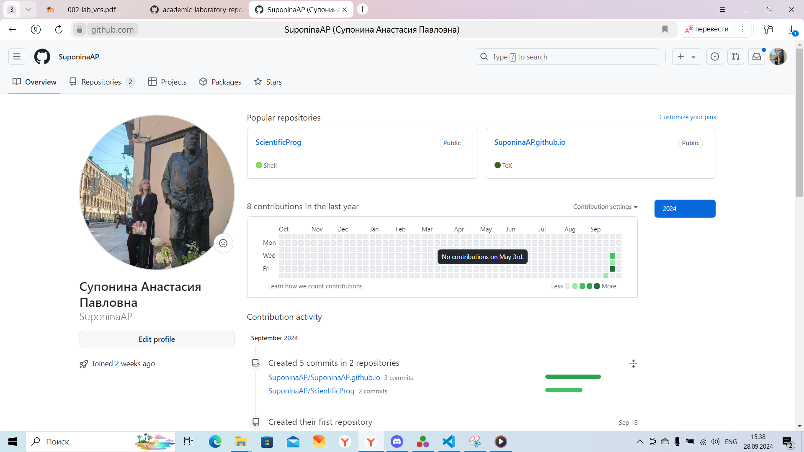
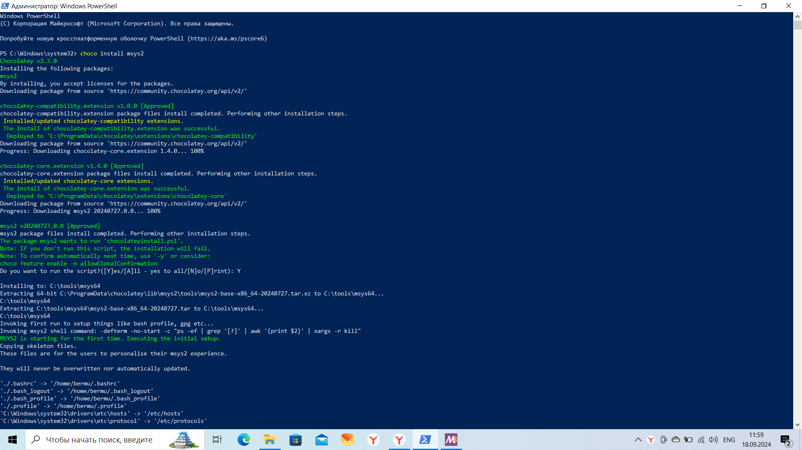
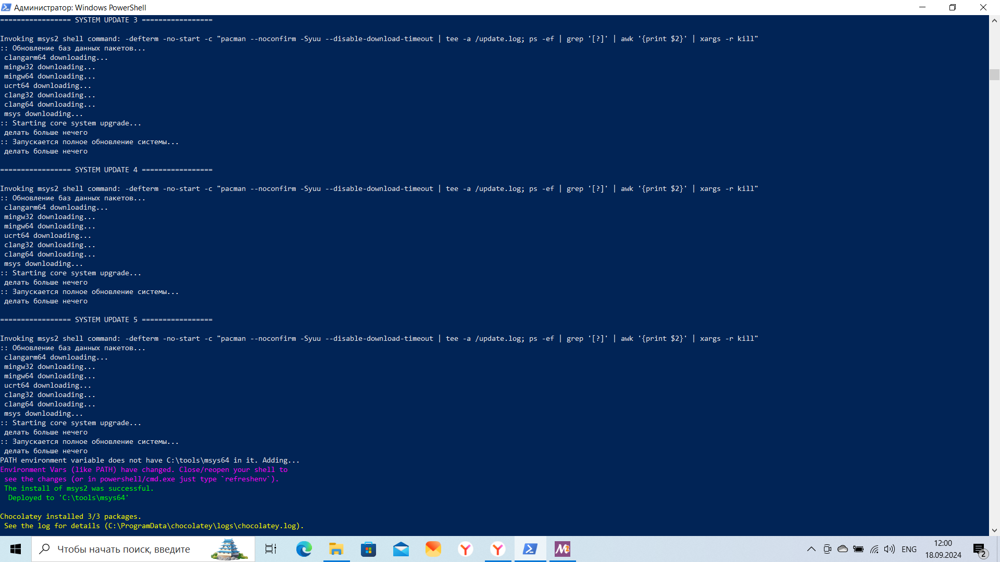
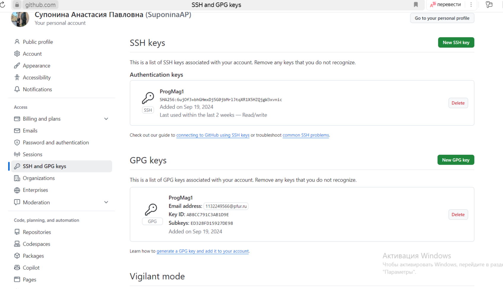
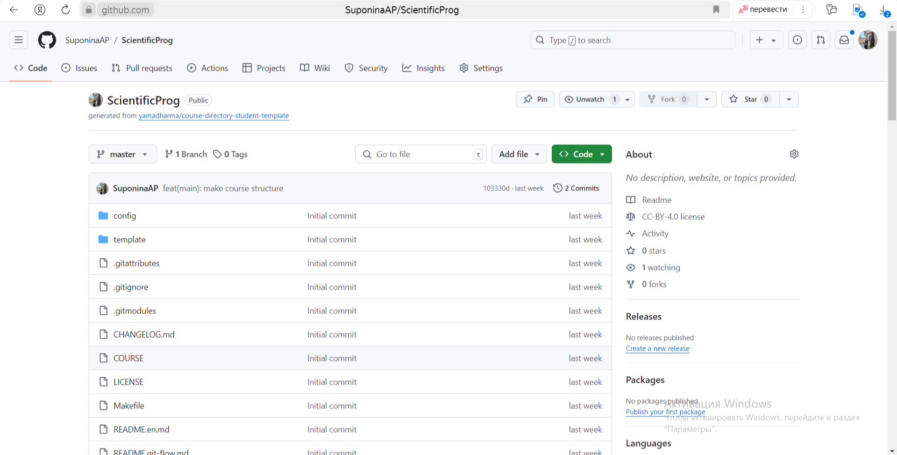

---
## Front matter
title: "Отчёт по лабораторной работе 1"
author: "Супонина Анастасия Павловна"

## Generic otions
lang: ru-RU
toc-title: "Содержание"

## Bibliography
bibliography: bib/cite.bib
csl: pandoc/csl/gost-r-7-0-5-2008-numeric.csl

## Pdf output format
toc: true # Table of contents
toc-depth: 2
lof: true # List of figures
lot: true # List of tables
fontsize: 12pt
linestretch: 1.5
papersize: a4
documentclass: scrreprt
## I18n polyglossia
polyglossia-lang:
  name: russian
  options:
  - spelling=modern
  - babelshorthands=true
polyglossia-otherlangs:
  name: english
## I18n babel
babel-lang: russian
babel-otherlangs: english
## Fonts
mainfont: IBM Plex Serif
romanfont: IBM Plex Serif
sansfont: IBM Plex Sans
monofont: IBM Plex Mono
mathfont: STIX Two Math
mainfontoptions: Ligatures=Common,Ligatures=TeX,Scale=0.94
romanfontoptions: Ligatures=Common,Ligatures=TeX,Scale=0.94
sansfontoptions: Ligatures=Common,Ligatures=TeX,Scale=MatchLowercase,Scale=0.94
monofontoptions: Scale=MatchLowercase,Scale=0.94,FakeStretch=0.9
mathfontoptions:
## Biblatex
biblatex: true
biblio-style: "gost-numeric"
biblatexoptions:
  - parentracker=true
  - backend=biber
  - hyperref=auto
  - language=auto
  - autolang=other*
  - citestyle=gost-numeric
## Pandoc-crossref LaTeX customization
figureTitle: "Рис."
tableTitle: "Таблица"
listingTitle: "Листинг"
lofTitle: "Список иллюстраций"
lotTitle: "Список таблиц"
lolTitle: "Листинги"
## Misc options
indent: true
header-includes:
  - \usepackage{indentfirst}
  - \usepackage{float} # keep figures where there are in the text
  - \floatplacement{figure}{H} # keep figures where there are in the text
---

# Цель работы

Ознакомиться с системой контроля версий git. Изучить базовые конфигурации и научиться вносить изменения в репозиторий при помощи функций git.

# Задание

1) Зарегистрироваться на Github.
2) Создать базовую конфигурацию для работы с git.
3) Создать ключ SSH.
4) Создать ключ PGP.
5) Настроить подписи git. 
6) Создать локальный каталог для выполнения заданий по предмету.

# Теоретическое введение

## Базовая настройка git

git config --global user.name "Name Surname" - задает имя владельца репозитория 

git config --global user.email "work@mail" - задает email владельца репозитория 

git config --global core.quotepath false - настройка utf-8 в выводе сообщений git

git config --global init.defaultBranch master - задает имя начальной ветки

git config --global core.autocrlf input - настройка параметра autocrlf

git config --global core.safecrlf warn - настройка параметра safecrlf

## Команды для создания ключей ssh

ssh-keygen -t rsa -b 4096 - по алгоритму rsa с ключём размером 4096 бит

ssh-keygen -t ed25519 - – по алгоритму ed25519

## Команды для работы с ключами gpg

gpg --full-generate-key - генерация gpg ключа с настройками

gpg --list-secret-keys --keyid-format LONG - вывод списка ключей

gpg --armor --export <PGP Fingerprint> | xclip -sel clip - копирование ключа в буфер обмена

## Команды для настройки автоматических подписей коммитов git

git config --global user.signingkey <PGP Fingerprint>

git config --global commit.gpgsign true

git config --global gpg.program $(which gpg2)

## Для настройки каталога курса

cd - переход в нужную папку

make - создание новой папки/файла

rm - удаление ненужной папки/файла 

***Отправка файлов на сервер:***

git add .

git commit -am 'feat(main): make course structure'

git push

# Выполнение лабораторной работы

## 1) Зарегистрироваться на Github.

Создаю учетную запись на портале GitHub, для дальнейшей работы и загрузки репозитория. Ссылка на профиль https://github.com/SuponinaAP/ScientificProg
{#fig:002 width=50%}

## 2) Создать базовую конфигурацию для работы с git. 

### ***Установка программного обеспечения***

Устанавливаю программное обеспечение при помощи Chocolate, через команду в Windows PowerShell.

{#fig:001 width=50%}

{#fig:002 width=50%}
Описываются проведённые действия, в качестве иллюстрации даётся ссылка на иллюстрацию (рис. [-@fig:001]).

### ***Базовая настройка git***

Провожу базовую настройку git при помощи команд указанных в теоретической части.
{#fig:003 width=50%}

## 3) Создать ключ SSH.

При помощи команд создаю ключи SSH.
- по алгоритму rsa
{#fig:003 width=50%}

- по алгоритму ed25519
{#fig:003 width=50%}

## 4) Создать ключ PGP.

Генерирую gpg ключ, со следующими параметрами:

– тип RSA and RSA;

– размер 4096;

– выберите срок действия; значение по умолчанию— 0 (срок действия не истекает
никогда).
{#fig:003 width=50%}
{#fig:003 width=50%}

Далее захожу на гитхаб в настройки пользователя, вкладка ssh и gpg, и добавляю туда ранее сгенерированные ключи.

Ввожу команду для того чтобы получить отпечаток приватного ключа и с ним выполнить команду на его вывод.
{#fig:003 width=50%}

Для копирования gpg ключа использую команду
***gpg --armor --export <PGP Fingerprint>***
которая выводит на экран сам ключ.
{#fig:003 width=50%}

## 5) Настроить подписи git.

Используя программы из теоретической части, настраиваю автоматические подписи коммитов git.
{#fig:003 width=50%}

## 6) Создать локальный каталог для выполнения заданий по предмету.

Так как работа производиться через ОС Windows, черз страницу гитхаб копирую себе репозиторий. При помощи msys2 сохраняю на компьютер репозиторий и удаляю файл package.gson, а также создаю необходимые каталоги.

Отправляю результаты обратно на сервер при помощи ранее упомянутых команд.
{#fig:003 width=50%}

Проверяю изменения зайдя на GitHub
{#fig:003 width=50%}
# Выводы

В процессе работы научилась пользоваться основными фукциями git, ознакомилась с работой платформы GitHub, также изучила все базовые конфигурации и научилась вносить изменения пользуясь системой контроля версий git.

# Список литературы{.unnumbered}

::: Пособие по лабораторной работе 1 {https://esystem.rudn.ru/pluginfile.php/2372898/mod_resource/content/5/002-lab_vcs.pdf}
::: Пособие по лабораторной работе 2 {https://esystem.rudn.ru/pluginfile.php/2372900/mod_resource/content/4/003-lab_markdown.pdf}

