---
## Front matter
lang: ru-RU
title: Научное программирование
author: Супонина Анастасия Павловна
institute: РУДН, Москва, Россия

date: 5 Октября 2024

## Formatting
toc: false
slide_level: 2
theme: metropolis
header-includes: 
 - \metroset{progressbar=frametitle,sectionpage=progressbar,numbering=fraction}
 - '\makeatletter'
 - '\beamer@ignorenonframefalse'
 - '\makeatother'
aspectratio: 43
section-titles: true
---

# Лабораторная работа 3

## Простейшие операции

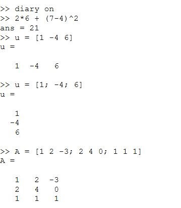

## Операции с векторами

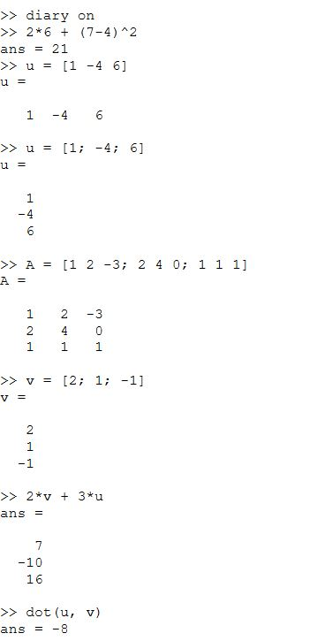
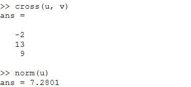

## Вычисление проектора

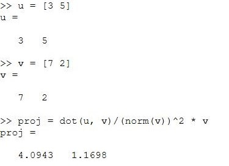

## Матричные операции

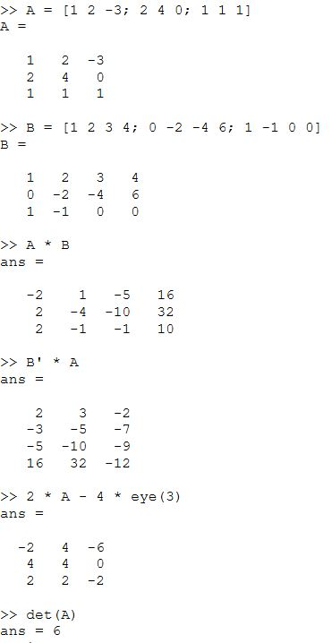
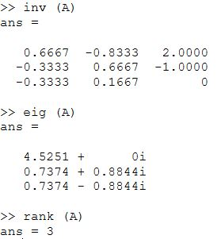

## Построение графиков - Прострейшие (команды)  

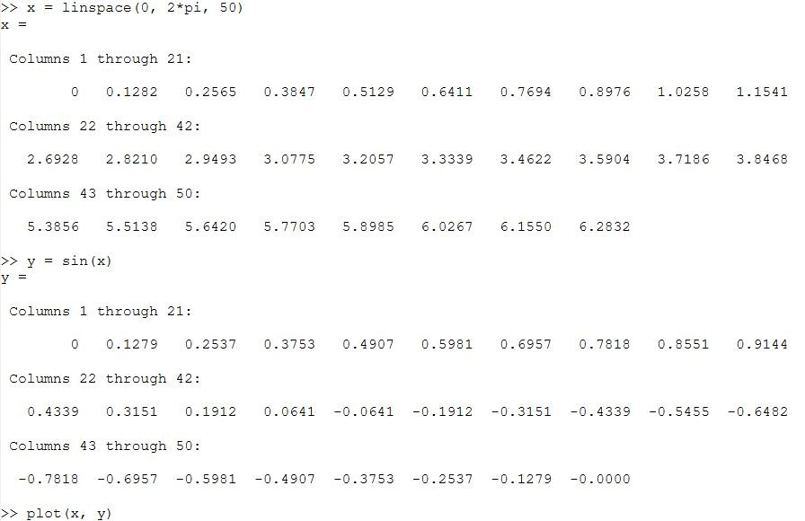
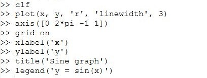

## Построение графиков - Прострейшие (результат)  

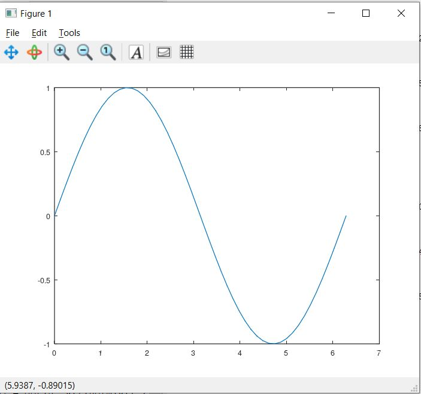
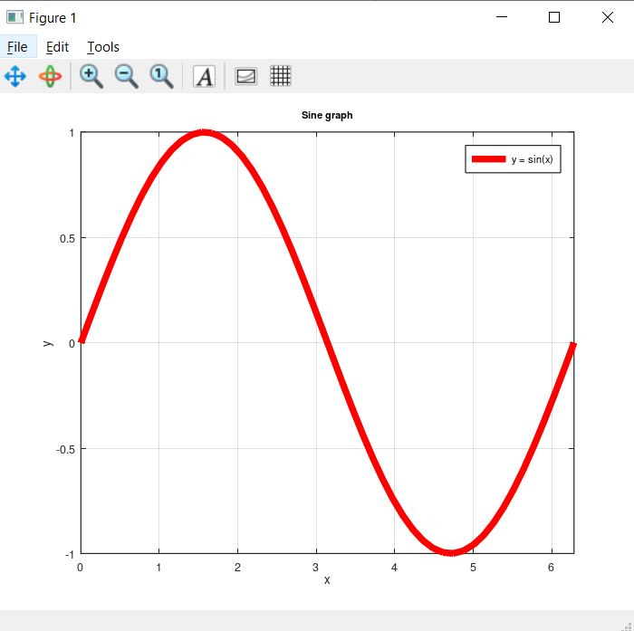

## Построение графиков - Два графика на одном чертеже (команды) 

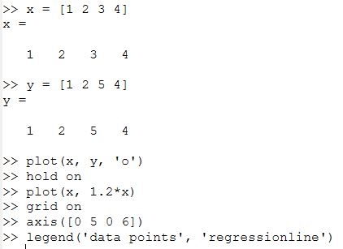

## Построение графиков - Два графика на одном чертеже (результат) 

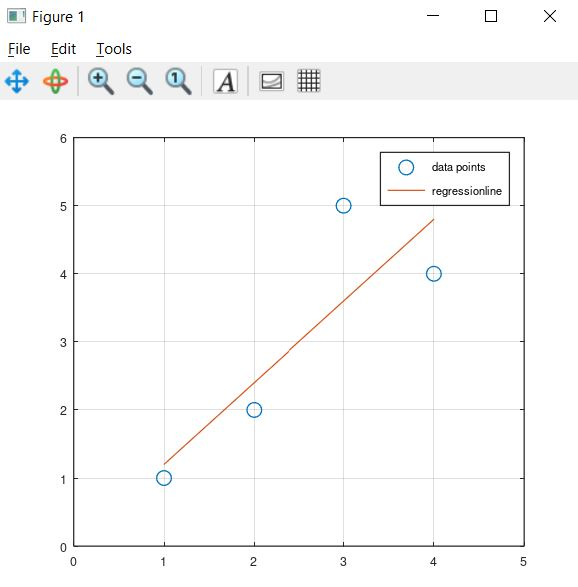

## Построение графиков - График $ 𝑦 = 𝑥^2sinx $ (команды) 

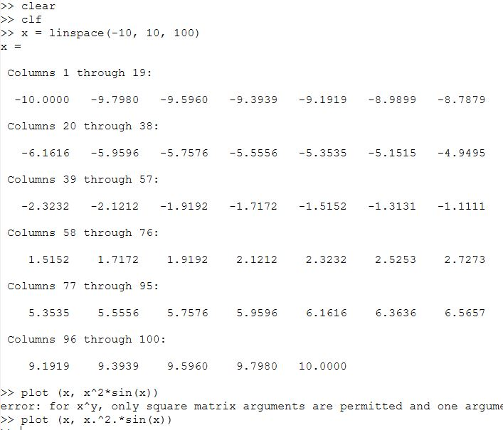

## Построение графиков - График $ 𝑦 = 𝑥^2sinx $ (результат) 

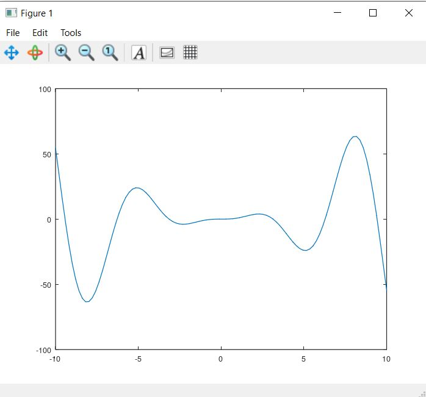

## Сравнение циклов и операций с векторами (первый документ)

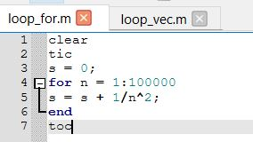[Документ 1](LabShPr3/loop_for.m)

## Сравнение циклов и операций с векторами (второй документ)

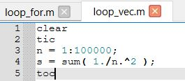[Документ 2](LabShPr3/loop_vec.m)

## Сравнение циклов и операций с векторами (запуск документов)

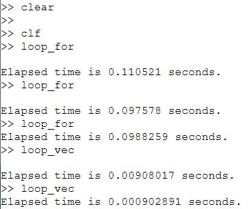

# Выводы

Ознакомилась с Octave. Научилась работать с векторами и матрицами, создавать отдельные документы для выполнения. Обрела навыки работы с различными графиками и их оформлением.

## {.standout}

Спасибо за внимание!

## Добавление поста

