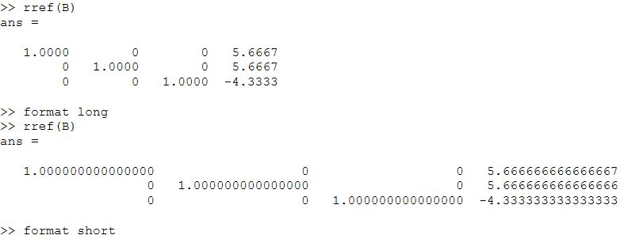
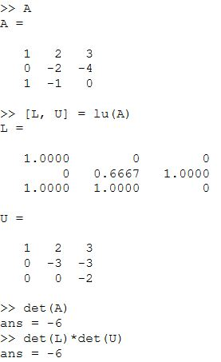
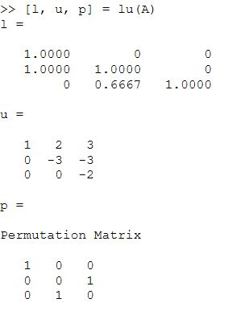

---
## Front matter
lang: ru-RU
title: Научное программирование
author: Супонина Анастасия Павловна
institute: РУДН, Москва, Россия

date: 5 Октября 2024

## Formatting
toc: false
slide_level: 2
theme: metropolis
header-includes: 
 - \metroset{progressbar=frametitle,sectionpage=progressbar,numbering=fraction}
 - '\makeatletter'
 - '\beamer@ignorenonframefalse'
 - '\makeatother'
aspectratio: 43
section-titles: true
---

# Лабораторная работа 4

## Метод Гаусса(строки или столбцы)

## Метод Гаусса(Решение и функция rref)

## Изменение формата чисел в матрице

## Левое деление матриц

Применяя оператор "/", получаю значения для всех x.

## LU - разложение

Используя функцию lu, получаю угловые матрицы L и U из матрицы A. Также провожу проверку.

## LUP - разложение

Используя функцию lu, получаю LUP - разложение матрицы A

# Выводы

В процессе выполнения работы, я узнала о новых функциях  в Octave. А именно rref, используемая для метода Гаусса, а также lu, используемая для множество разных разложений матрицы, а в данной работе я научилась использовать её для LU и LUP разложений. Также ознакомилась с методом решения СЛАУ при помощи левого деления и решила такую задачу в среде программирования Octave.

## {.standout}

Спасибо за внимание!

