---
## Front matter
lang: ru-RU
title: Научное программирование
author: Супонина Анастасия Павловна
institute: РУДН, Москва, Россия

date: 5 Октября 2024

## Formatting
toc: false
slide_level: 2
theme: metropolis
header-includes: 
 - \metroset{progressbar=frametitle,sectionpage=progressbar,numbering=fraction}
 - '\makeatletter'
 - '\beamer@ignorenonframefalse'
 - '\makeatother'
aspectratio: 43
section-titles: true
---

# Лабораторная работа 5

## Цель работы

Ознакомиться с подгонкой полиномиальной кривой, а также с различными матричными преобразованиями в Octave. Научиться вращать, отражать и дилатировать изображения на графике.

## Подгонка полиномиальной кривой

## Ввожу матрицу и извлекаю из неё значения x и y

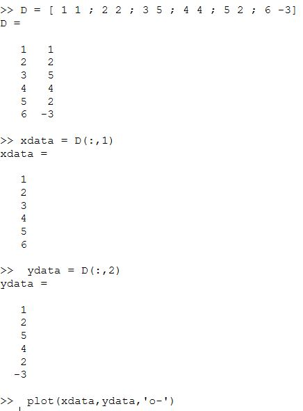

## При помощи полученных значений строю график 

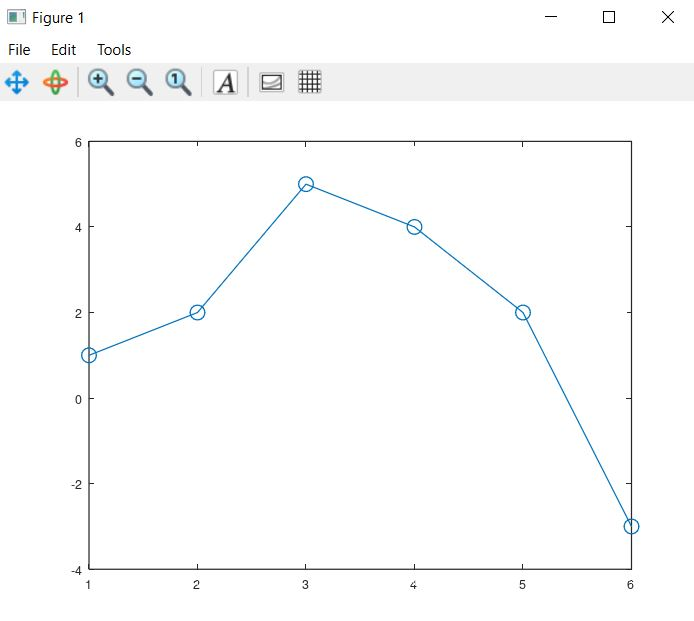

## Строю из матриц уравнение вида $$  𝑦 = 𝑎𝑥^2 + 𝑏𝑥 + c $$.

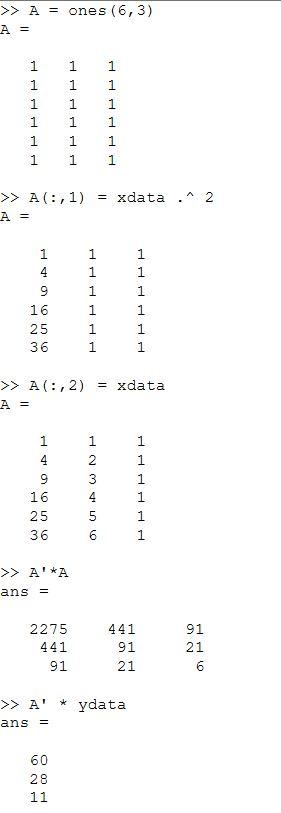

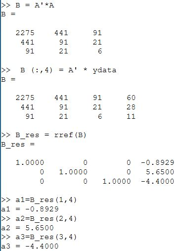

## График параболы

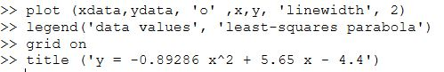
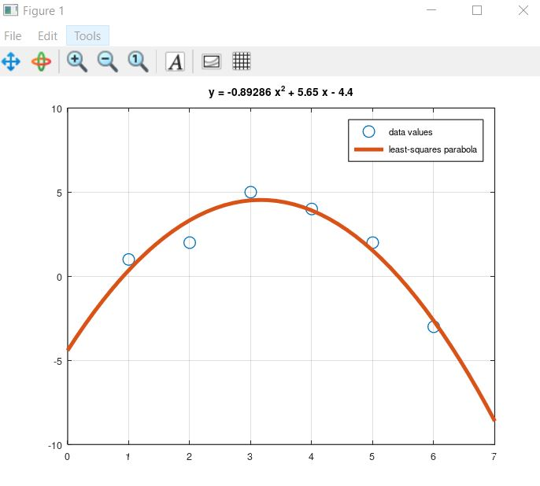

## Использую встроенную в Octave функцию для нахождения полинома polyfit

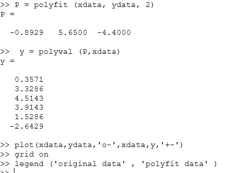

## Строю график с исходными и подгоночными данными

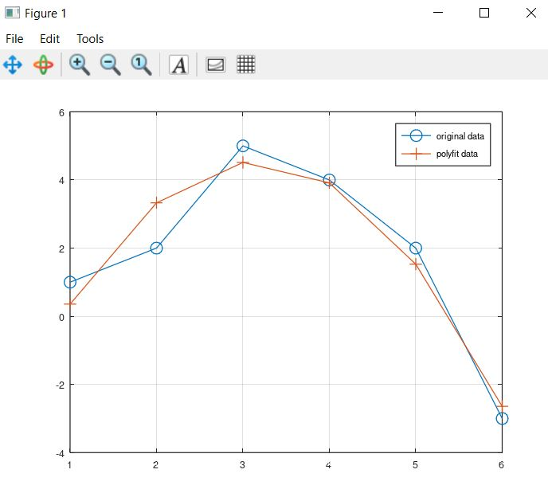

## Матричные преобразования

## Рисую граф в виде дома

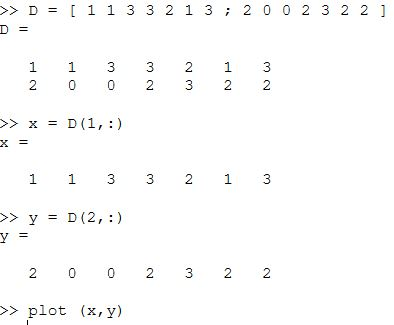
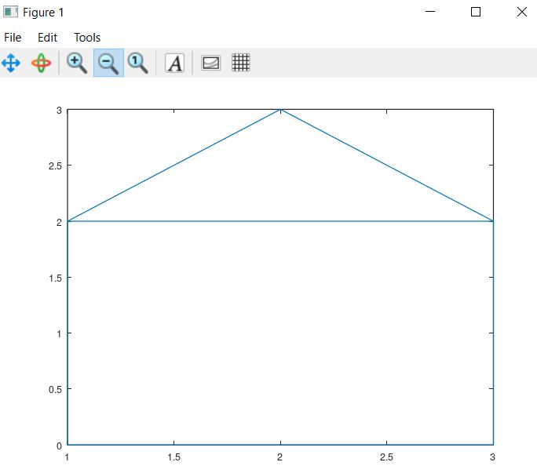

## Вращение(угол 90 градусов)

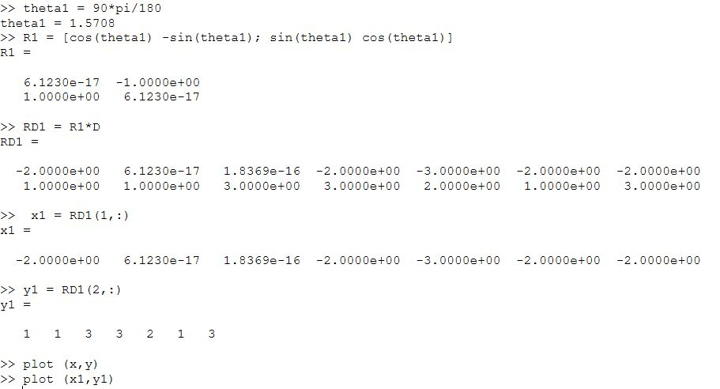

## Вращение(угол 225 градусов)

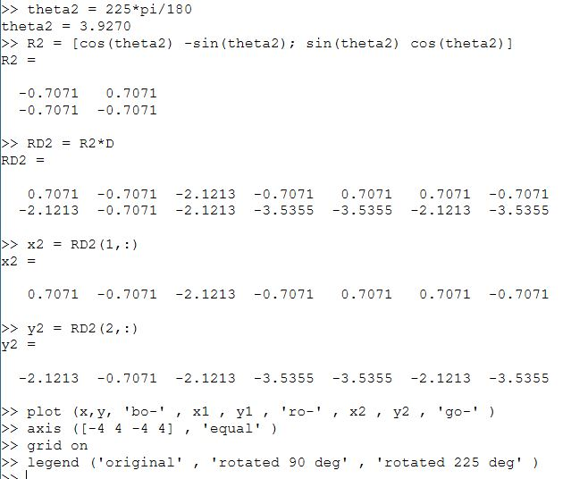

## Вращение(результат)

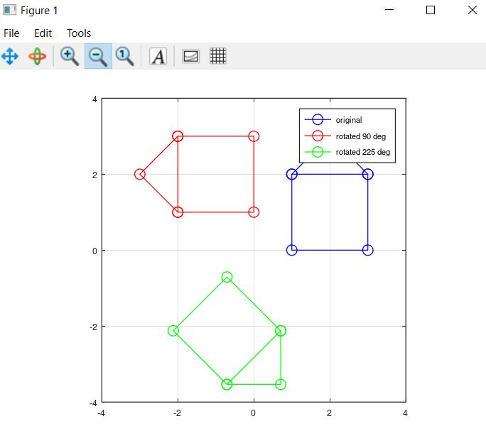

## Отражение(решение)

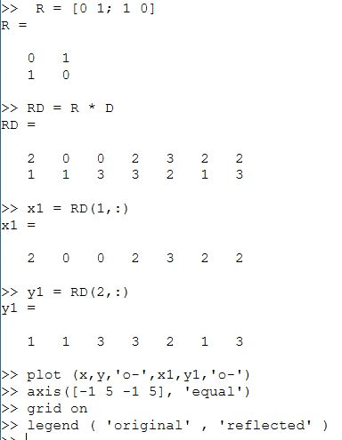

## Отражение(график)

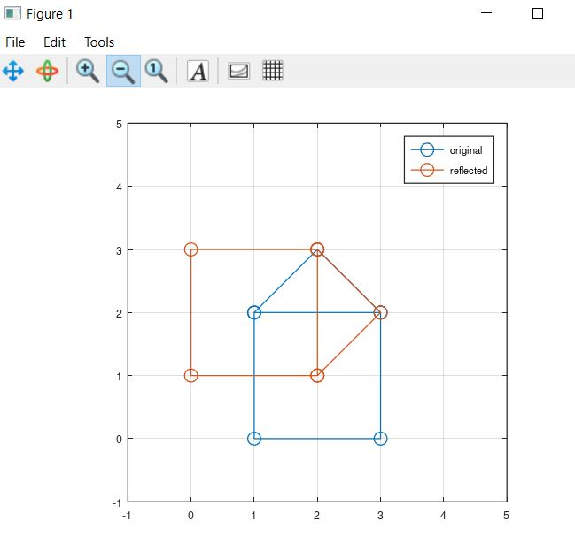

## Дилатация(решение)

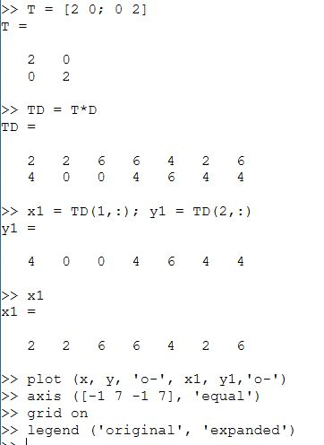

## Дилатация(график)

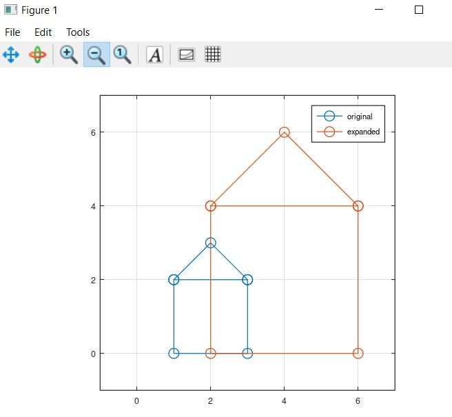

# Выводы

В процессе выполнения работы, я познакомилась с новыми функциями polyfit и polyval, необходимыми для получения полиномиальной кривой, а также научилась без этих функций выполнять подгонку к полиномиальной кривой использую метод наименьшего квадрата и преобразование Гаусса. Изучила матрицы необходимые для матричных преобразований. Научилась изменять графы, а именно отражать, вращать и дилатировать их, используя умножение матрицы исходного графа на специальные матрицы из теоретической части.

## {.standout}

Спасибо за внимание!

