---
## Front matter
lang: ru-RU
title: Научное программирование
author: Супонина Анастасия Павловна
institute: РУДН, Москва, Россия

date: 5 Октября 2024

## Formatting
toc: false
slide_level: 2
theme: metropolis
header-includes: 
 - \metroset{progressbar=frametitle,sectionpage=progressbar,numbering=fraction}
 - '\makeatletter'
 - '\beamer@ignorenonframefalse'
 - '\makeatother'
aspectratio: 43
section-titles: true
---

# Лабораторная работа 6

## Цель работы

Ознакомиться с вычислением пределов, последовательностей и рядов в Octave. 

## Предел

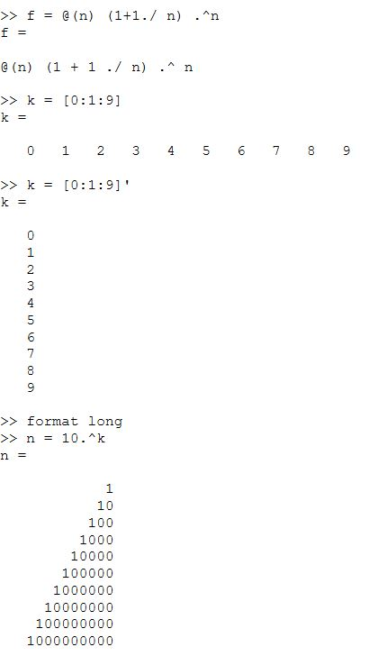
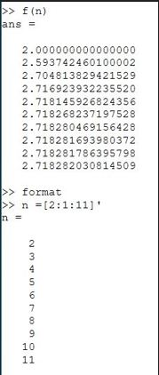

## Частичные суммы

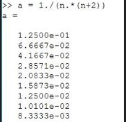
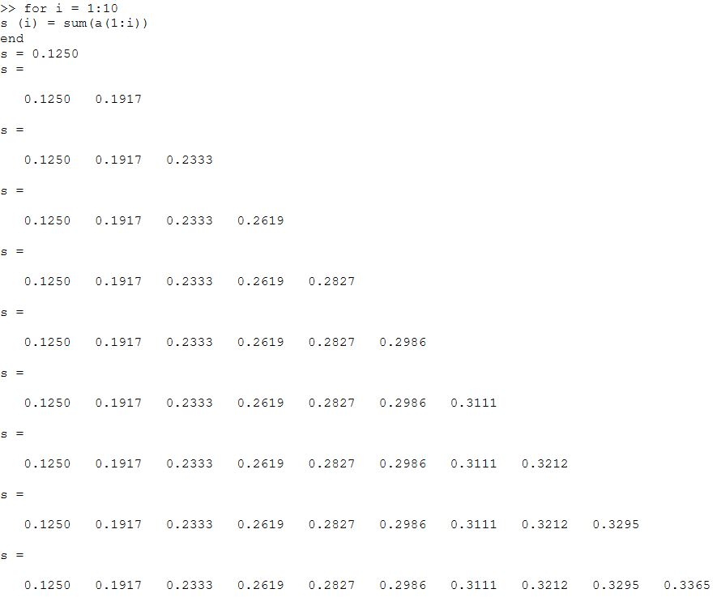

## Частичные суммы - график

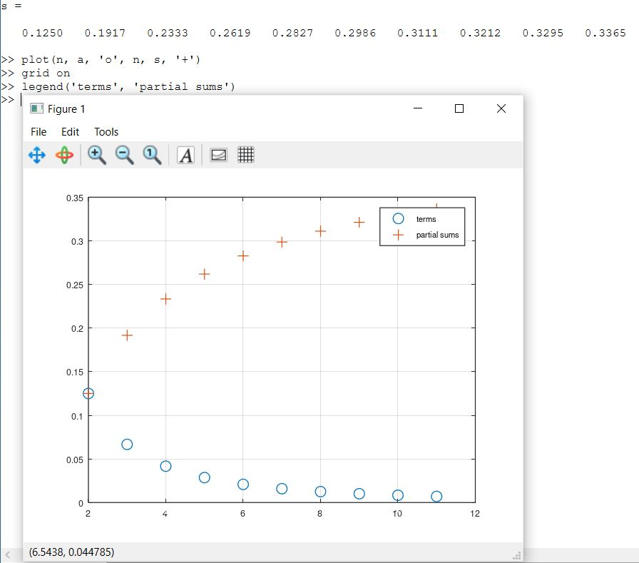

## Сумма ряда часть 1

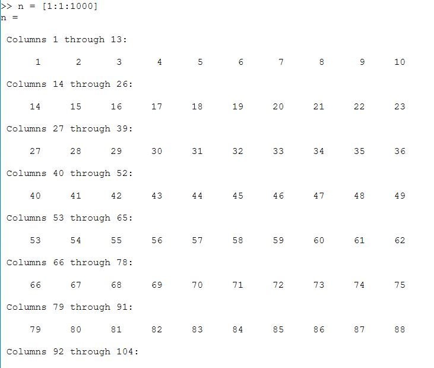

## Сумма ряда часть 2 

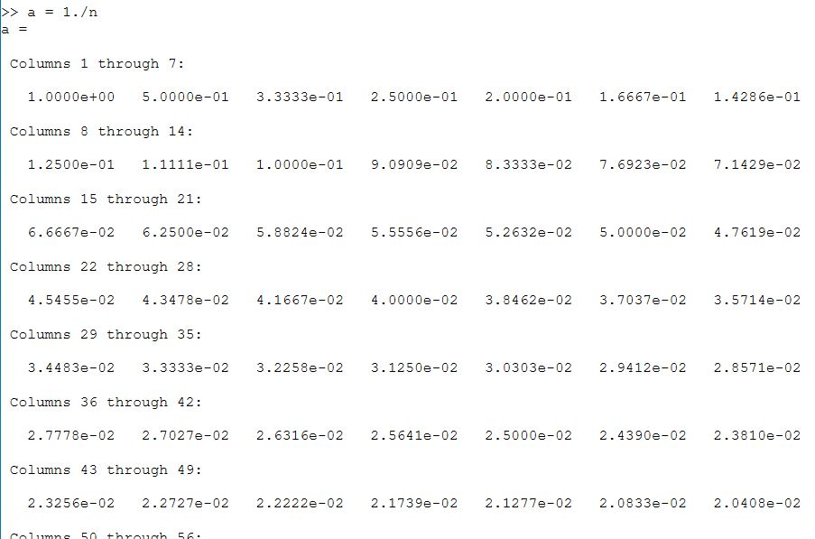

## Сумма ряда результат

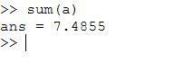

## Вычисление интеграллов

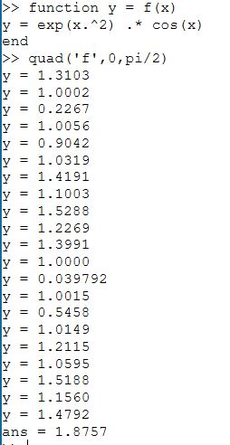

## Аппроксимирование суммами 1 вариант - создание файла

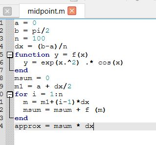

## Аппроксимирование суммами 1 вариант - результат выполнения

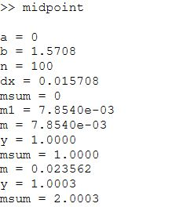
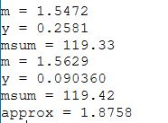

## Аппроксимирование суммами 2 вариант - создание файла

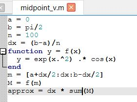

## Аппроксимирование суммами 2 вариант - результат выполнения

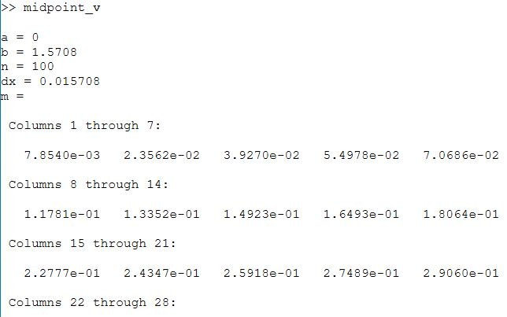
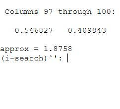

## Аппроксимирование суммами скорость выполнения 1 файла

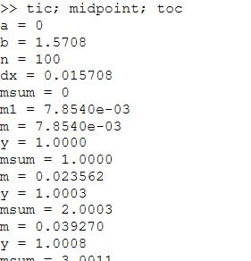
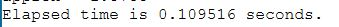

## Аппроксимирование суммами скорость выполнения 2 файла

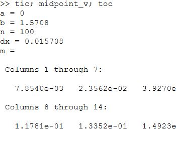
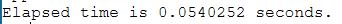

# Выводы

В процессе выполнения работы, я научилась вычислять пределы, последовательности и ряды в Octave.

## {.standout}

Спасибо за внимание!

