---
## Front matter
lang: ru-RU
title: Научное программирование
author: Супонина Анастасия Павловна
institute: РУДН, Москва, Россия

date: 5 Октября 2024

## Formatting
toc: false
slide_level: 2
theme: metropolis
header-includes: 
 - \metroset{progressbar=frametitle,sectionpage=progressbar,numbering=fraction}
 - '\makeatletter'
 - '\beamer@ignorenonframefalse'
 - '\makeatother'
aspectratio: 43
section-titles: true
---

# Лабораторная работа 7

# Цель работы

Ознакомиться с параметрическими графиками, полярными координатами, графиками неявных функций, комплексными числами и специальными функциями в Octave. 

# Задание.

Записать и построить графики:
1. Параметрической функции 
2. Полярных координат
3. Неявных функций 
4. Комплексных чисел
5. Специальных функций

# Выполнение работы

## Параметрическая функция

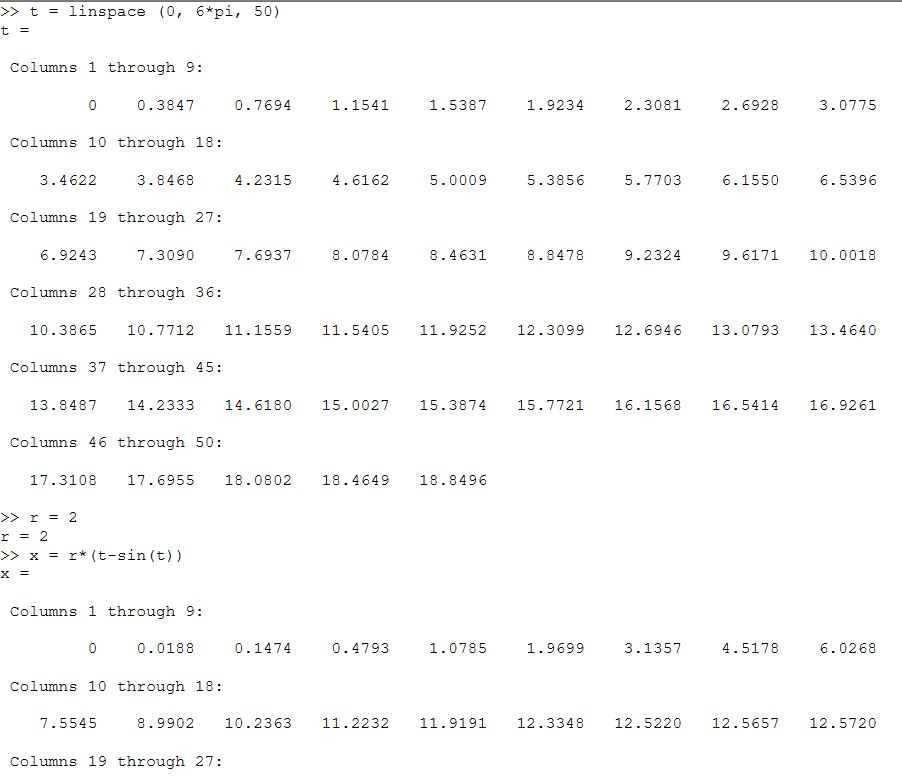
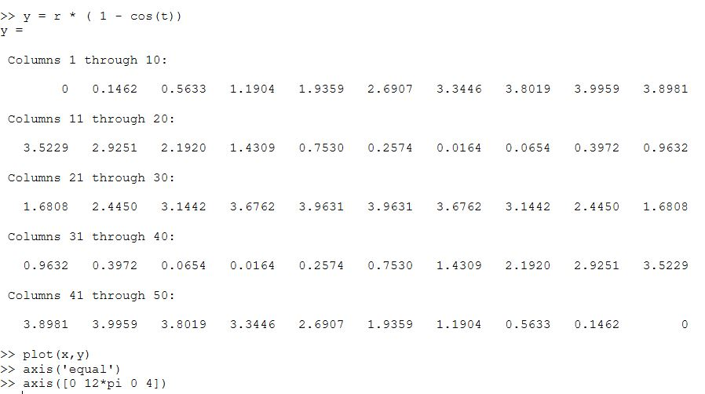
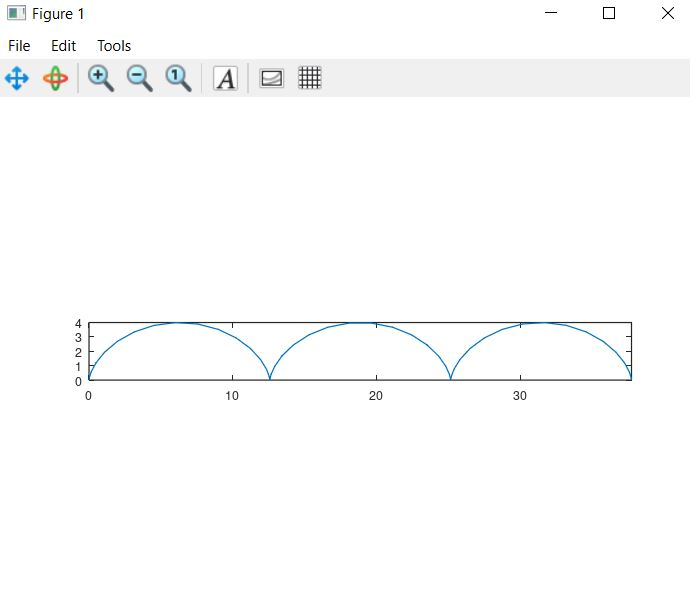

## Полярные координаты - улитка Паскаля

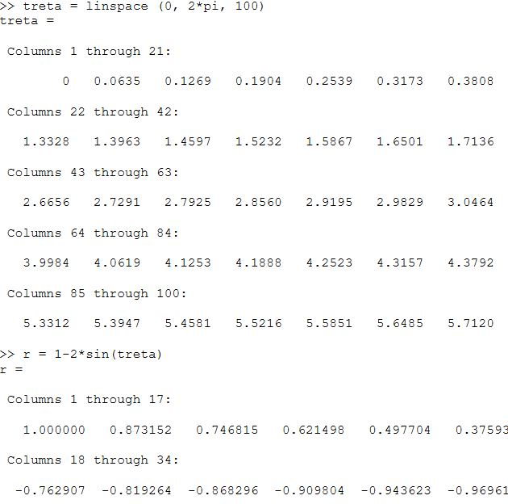
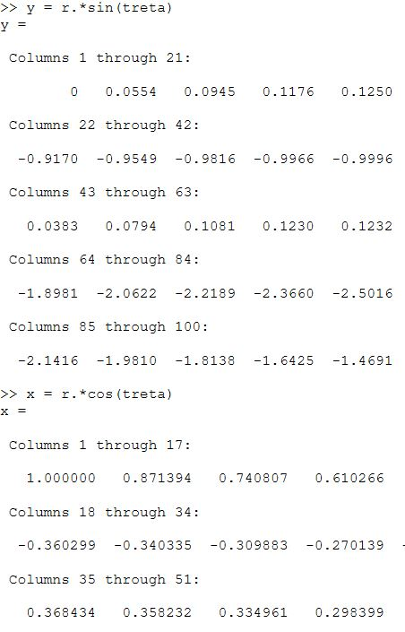
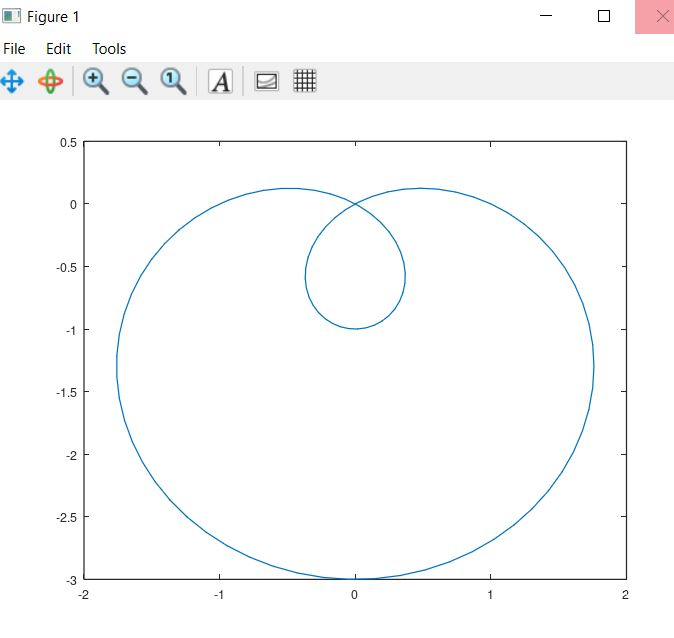

## График в полярных координатах

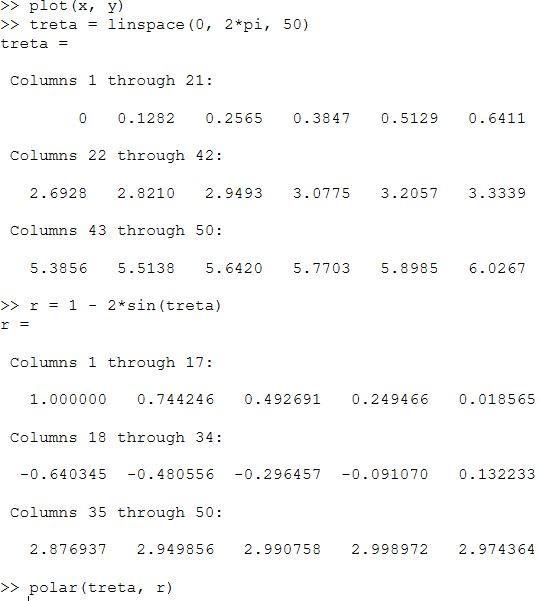
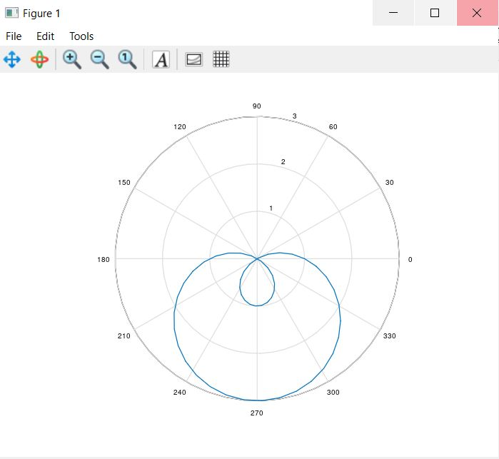

## Неявных функций - $f = -x^2 - x*y + x + y^2 - y - 1 $

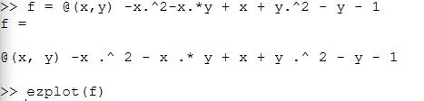
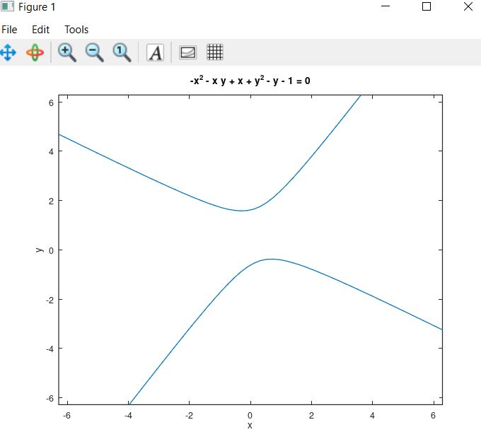

## Неявных функций - круг с касательной

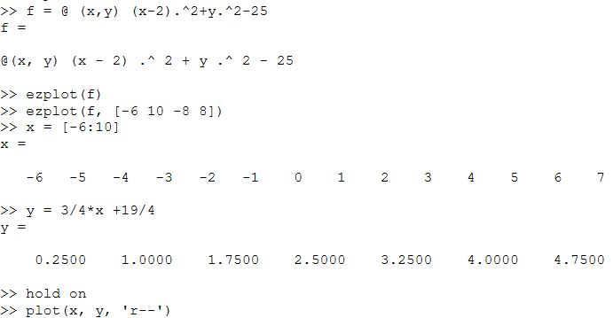
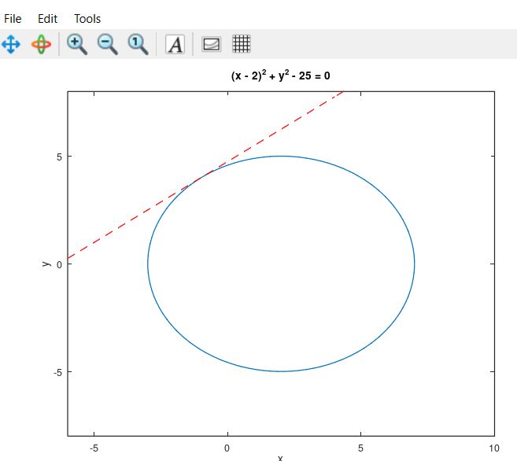

## Комплексные числа

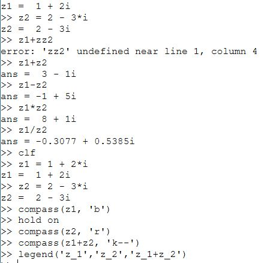
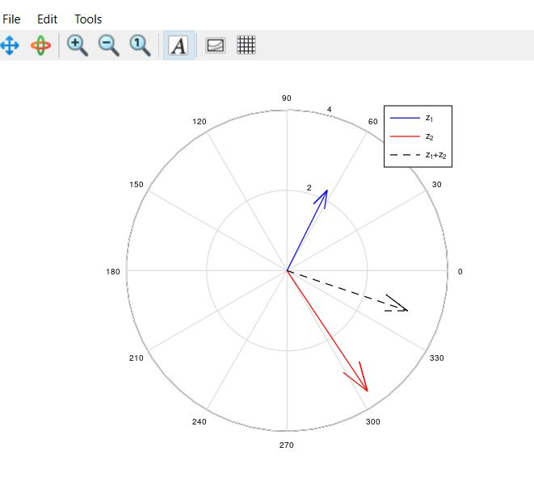

## Специальные функции $ Г(x+1) и n! $

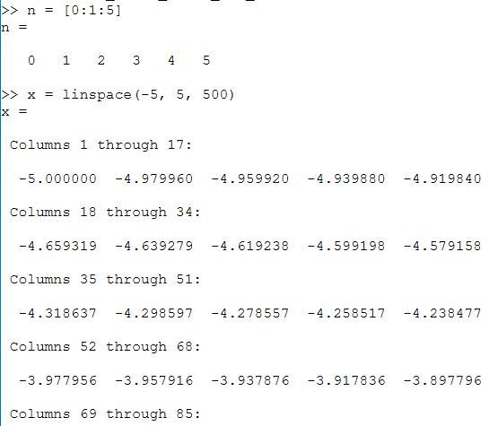
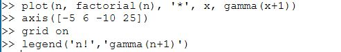
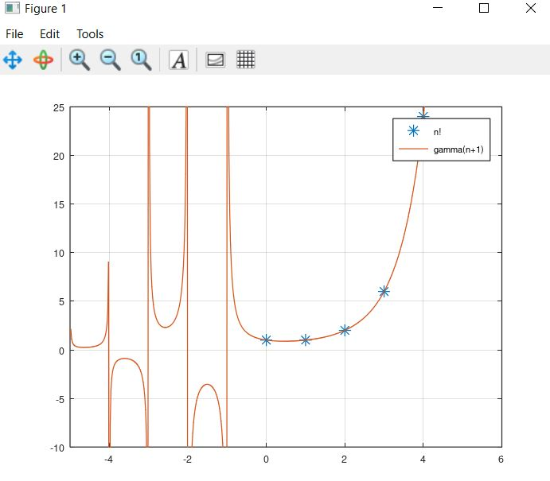

## Вычисления по частям для избавления от артефактов

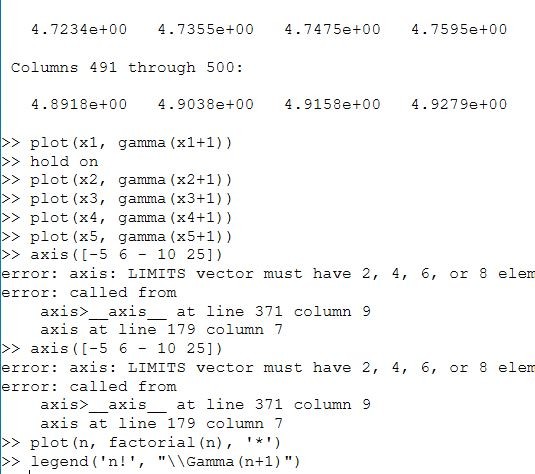
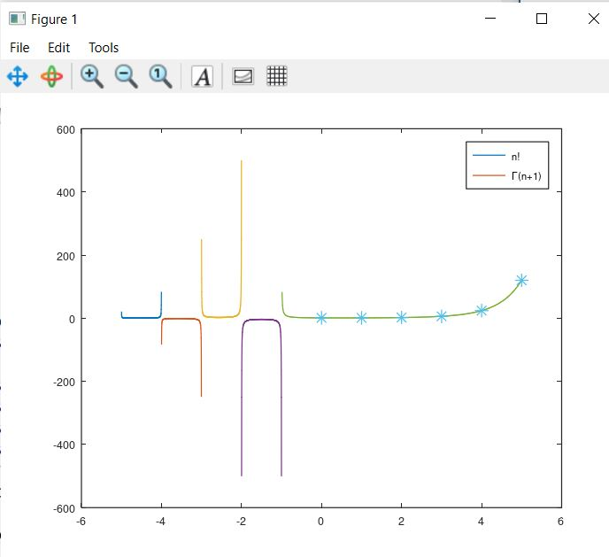

# Выводы

В процессе выполнения работы, я научилась работать с комплексными числами, строить на графиках специальные функции, строить графики в полярных координатах, а также выислять и строить графики параметрических и неявных функций в Octave.

