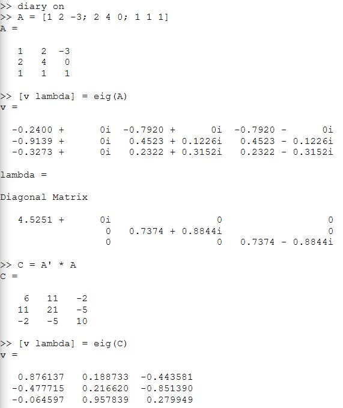
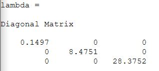
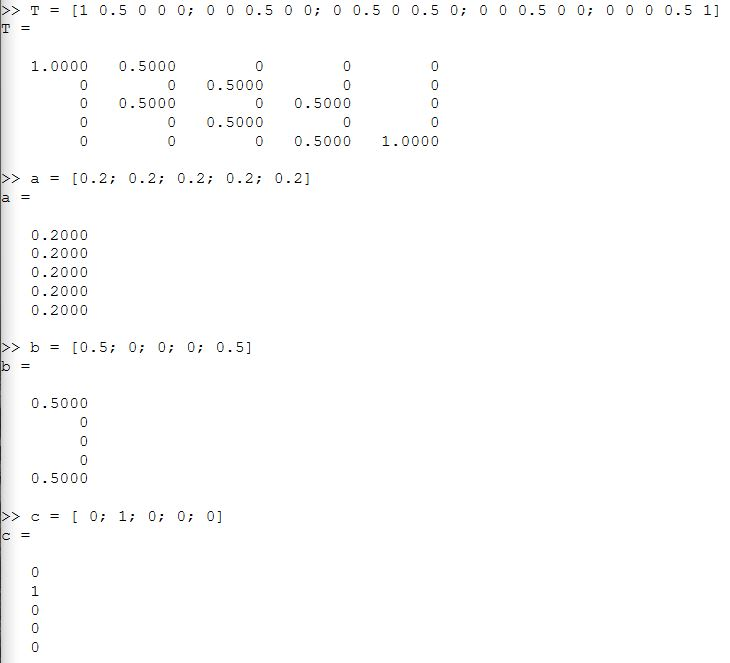
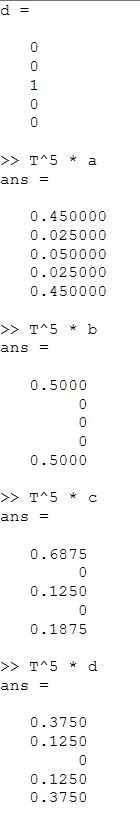
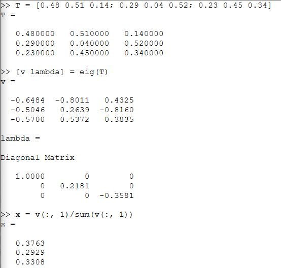
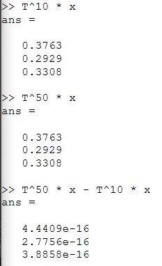

---
## Front matter
lang: ru-RU
title: Научное программирование
author: Супонина Анастасия Павловна
institute: РУДН, Москва, Россия

date: 5 Октября 2024

## Formatting
toc: false
slide_level: 2
theme: metropolis
header-includes: 
 - \metroset{progressbar=frametitle,sectionpage=progressbar,numbering=fraction}
 - '\makeatletter'
 - '\beamer@ignorenonframefalse'
 - '\makeatother'
aspectratio: 43
section-titles: true
---

# Лабораторная работа 8

## Цель работы

**Цель работы:** Научиться вычислять собственные значения и собственные векторы в Octave. 

**Задание.** Вычислить:
1. Собственные значения и собственные векторы 
2. Случайное блуждание и его равновестное состояние

## Собственные значения и собственные векторы

При помощи функции eig() нахожу собственные значения

## Случайное блуждание

Задаю матрицу Т и 5 различных начальных векторов, после чего по формуле $ T^k * a $ вычисляю вероятность будущего состояния

## Равновестное состояние

Нахожу равновестное состояние x, которое будет являться равновестным, если $x = Tx$, и проверяю действительно ли оно является равновестным

# Вывод

При выполнении данной лабораторной работы я научилась находить собственные значения и собственные вектора матрицы, а также вычислять случайное блуждание и равновестное состояние в среде программирования Octave.

