---
## Front matter
title: "Отчёт по индивидуальной лабораторной работе 2"
author: "Супонина Анастасия Павловна"

## Generic otions
lang: ru-RU
toc-title: "Содержание"

## Bibliography
bibliography: bib/cite.bib
csl: pandoc/csl/gost-r-7-0-5-2008-numeric.csl

## Pdf output format
toc: true # Table of contents
toc-depth: 2
lof: true # List of figures
lot: true # List of tables
fontsize: 12pt
linestretch: 1.5
papersize: a4
documentclass: scrreprt
## I18n polyglossia
polyglossia-lang:
  name: russian
  options:
  - spelling=modern
  - babelshorthands=true
polyglossia-otherlangs:
  name: english
## I18n babel
babel-lang: russian
babel-otherlangs: english
## Fonts
mainfont: IBM Plex Serif
romanfont: IBM Plex Serif
sansfont: IBM Plex Sans
monofont: IBM Plex Mono
mathfont: STIX Two Math
mainfontoptions: Ligatures=Common,Ligatures=TeX,Scale=0.94
romanfontoptions: Ligatures=Common,Ligatures=TeX,Scale=0.94
sansfontoptions: Ligatures=Common,Ligatures=TeX,Scale=MatchLowercase,Scale=0.94
monofontoptions: Scale=MatchLowercase,Scale=0.94,FakeStretch=0.9
mathfontoptions:
## Biblatex
biblatex: true
biblio-style: "gost-numeric"
biblatexoptions:
  - parentracker=true
  - backend=biber
  - hyperref=auto
  - language=auto
  - autolang=other*
  - citestyle=gost-numeric
## Pandoc-crossref LaTeX customization
figureTitle: "Рис."
tableTitle: "Таблица"
listingTitle: "Листинг"
lofTitle: "Список иллюстраций"
lotTitle: "Список таблиц"
lolTitle: "Листинги"
## Misc options
indent: true
header-includes:
  - \usepackage{indentfirst}
  - \usepackage{float} # keep figures where there are in the text
  - \floatplacement{figure}{H} # keep figures where there are in the text
---

# Цель работы

Ознакомиться с Octave. Изучить основные функции. Научиться выполнять простейшие операции, операции с векторами, операции с матрицами. Научиться строить графики и изменять их внешний вид, а также научиться строить несколько графиков на одном чертеже. Научиться создавать отдельные файлы и запускать их.

# Задание.

1) Выполнить простейшие операции
2) Сделать операции с векторами
3) Провести вычисление проектора
4) Совершить матричные операции
5) Построить следующие графики:  
    1. прострейшие
    2. два графика на одном чертеже
    3. График $ 𝑦 = 𝑥^2sinx $
6) Сравненить циклы и операции с векторами

# Теоретическая часть

GNU Octave — свободная программная система для математических вычислений, использующая совместимый с MATLAB язык высокого уровня.

Она позволяет стоить различные графики и редактировать их. 

# Выполнение работы

## Простейшие операции

Изучаю набор простейших операций доступных в Octave

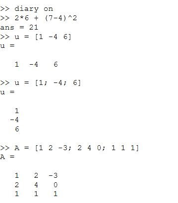

## Операции с векторами

Использую команды для работы с векторами в среде Octave

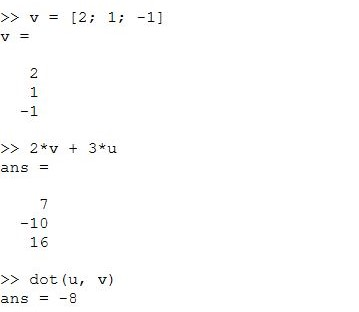
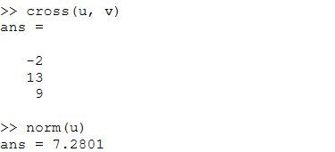

## Вычисление проектора

При помощи формулы $ proj = dot(u, v)/(norm(v))^2 * v $ вычисляю проектор двух векторов

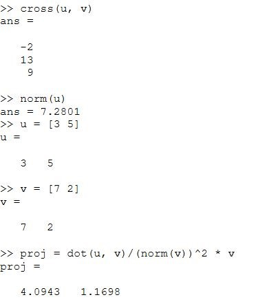

## Матричные операции

При помощи Octave создаю матрицы и провожу математические операции над ними

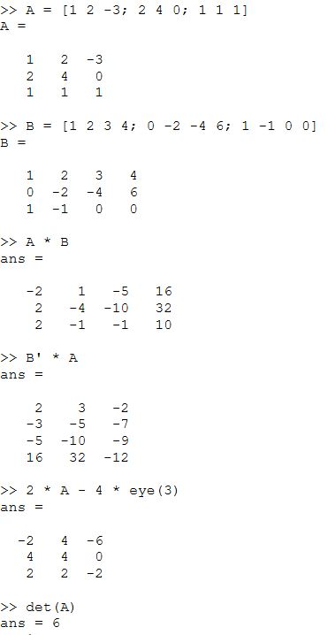
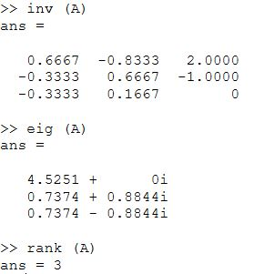

## Построение графиков:  

### Прострейшие

Строю график функции $ sin 𝑥 $ на интервале $ [0, 2π] $

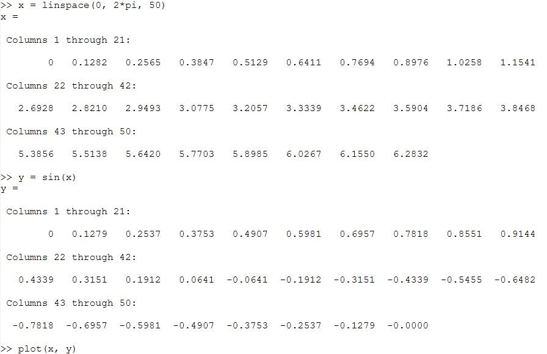

Получаю следующее отображение

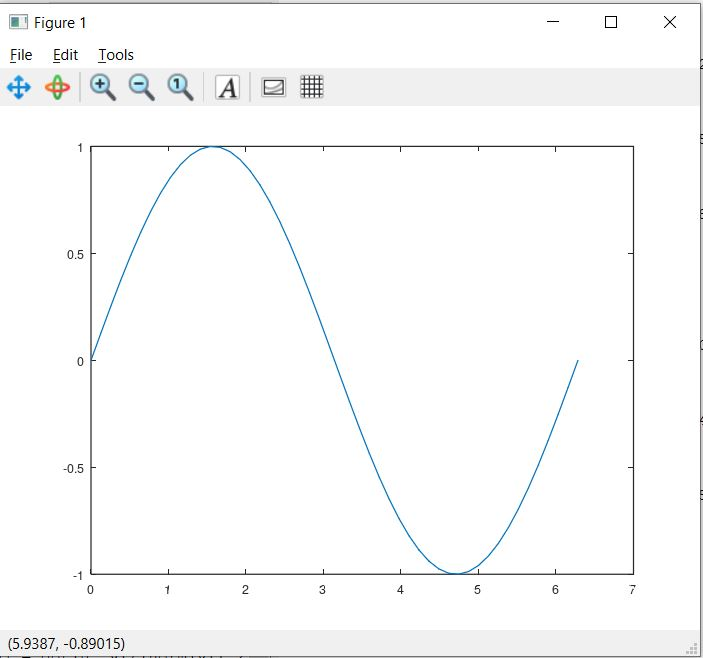

Вношу изменение в легенду графика, а также редактирую цвет и толщину линии при помощи следующих команд

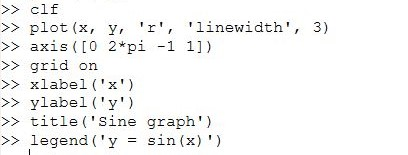

И теперь график принимает вид

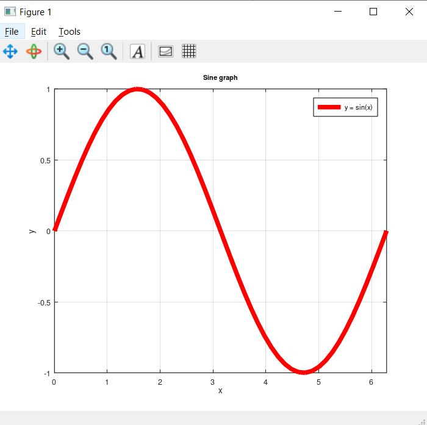

### Два графика на одном чертеже

Очищаю старые данные и создаю два графика отображаемые на одном чертеже

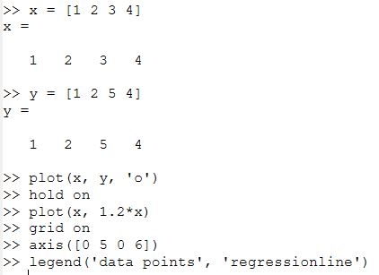

Которые отображаются следующим образом

### График $ 𝑦 = 𝑥^2sinx $

Строю график $ 𝑦 = 𝑥^2sinx $, важным становиться правильная запись операторов, не в матричном виде ^ и *, а в поэлементном .^ и $ .* $.

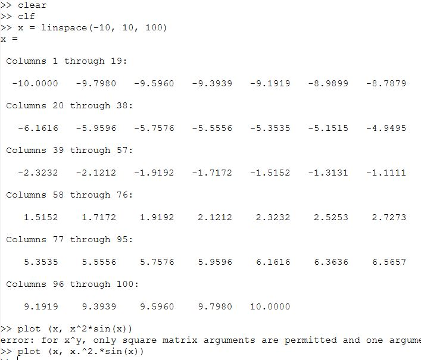

Получаю

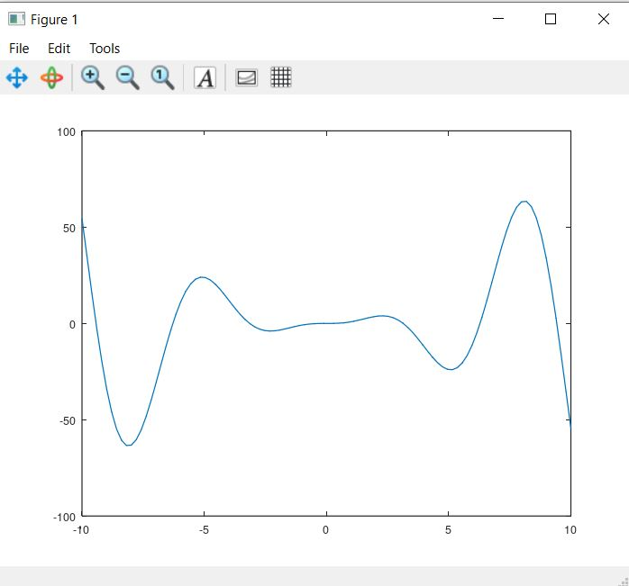

## Сравнение циклов и операций с векторами

Создаю два документа с командами для сравнения 

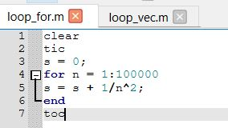[Документ 1](LabShPr3/loop_for.m)
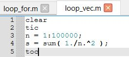[Документ 2](LabShPr3/loop_vec.m)

Запускаю документы через консоль и получаю следующие результаты

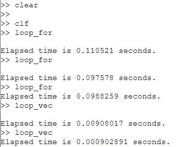

# Выводы

Ознакомилась с Octave. Научилась работать с векторами и матрицами, создавать отдельные документы для выполнения. Обрела навыки работы с различными графиками и их оформлением.

