---
## Front matter
title: "Отчёт по лабораторной работе 6"
author: "Супонина Анастасия Павловна"

## Generic otions
lang: ru-RU
toc-title: "Содержание"

## Bibliography
bibliography: bib/cite.bib
csl: pandoc/csl/gost-r-7-0-5-2008-numeric.csl

## Pdf output format
toc: true # Table of contents
toc-depth: 2
lof: true # List of figures
lot: true # List of tables
fontsize: 12pt
linestretch: 1.5
papersize: a4
documentclass: scrreprt
## I18n polyglossia
polyglossia-lang:
  name: russian
  options:
  - spelling=modern
  - babelshorthands=true
polyglossia-otherlangs:
  name: english
## I18n babel
babel-lang: russian
babel-otherlangs: english
## Fonts
mainfont: IBM Plex Serif
romanfont: IBM Plex Serif
sansfont: IBM Plex Sans
monofont: IBM Plex Mono
mathfont: STIX Two Math
mainfontoptions: Ligatures=Common,Ligatures=TeX,Scale=0.94
romanfontoptions: Ligatures=Common,Ligatures=TeX,Scale=0.94
sansfontoptions: Ligatures=Common,Ligatures=TeX,Scale=MatchLowercase,Scale=0.94
monofontoptions: Scale=MatchLowercase,Scale=0.94,FakeStretch=0.9
mathfontoptions:
## Biblatex
biblatex: true
biblio-style: "gost-numeric"
biblatexoptions:
  - parentracker=true
  - backend=biber
  - hyperref=auto
  - language=auto
  - autolang=other*
  - citestyle=gost-numeric
## Pandoc-crossref LaTeX customization
figureTitle: "Рис."
tableTitle: "Таблица"
listingTitle: "Листинг"
lofTitle: "Список иллюстраций"
lotTitle: "Список таблиц"
lolTitle: "Листинги"
## Misc options
indent: true
header-includes:
  - \usepackage{indentfirst}
  - \usepackage{float} # keep figures where there are in the text
  - \floatplacement{figure}{H} # keep figures where there are in the text
---

# Цель работы

Ознакомиться с вычислением пределов, последовательностей и рядов в Octave. 

# Задание.

## Вычислить 

- Предел
- Частичные суммы
- Сумму ряда
- Интеграллы
- Аппроксимирование суммами

# Выполнение работы

## Предел

Записываю функцию f и @ обозначаю переменую данной функции, которую мы можем отдельно задавать и позднее изменять

Заднаю переменную и выполняю функцию с этой переменной

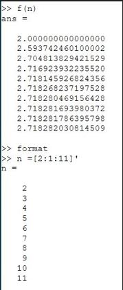

## Частичные суммы

Записываю значения вектора a

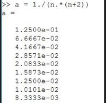

И в цикле от одного до десяти, суммирую i - значений 

Отобразила результат на графике

## Сумма ряда часть 1

Генерирую матрицу n, созначениями от 1 до 1000

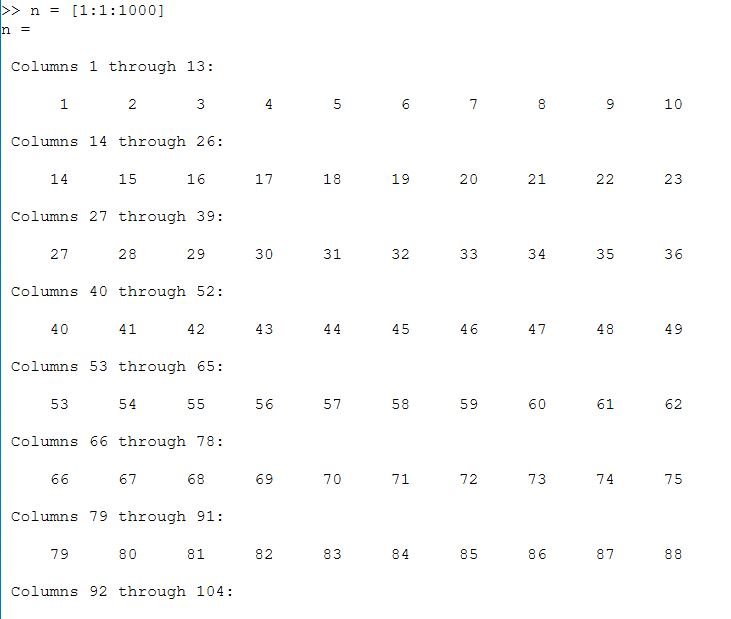

Генерирую матрицу а

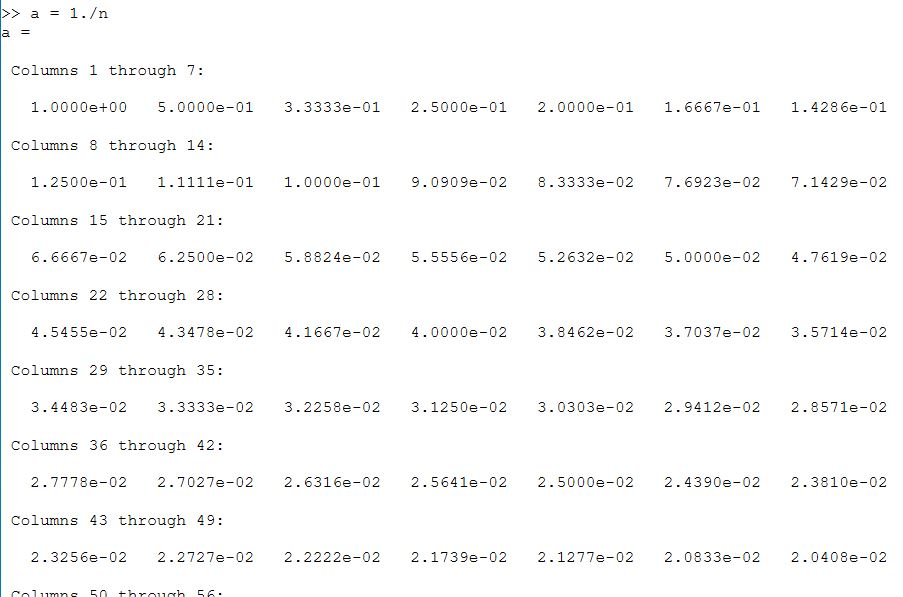

Считаю сумму и вывожу результат

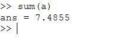

## Вычисление интеграллов

Создаю функцию f и при помощи quad получаю значение интеграла от данной функции

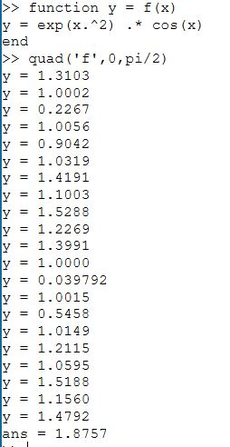

## Аппроксимирование суммами

Создаю файл для вычисления аппроксимации первым способом

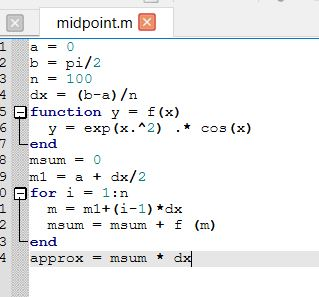

Сохраняю файл под названием midpoint и запускаю, чтобы в консоли увидеть результат выполнения

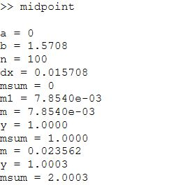
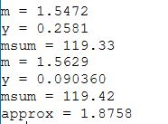

Создаю ещё один файл для вычисления аппроксимации вторым способом

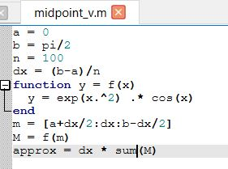

Сохраняю файл под названием midpoint_v и запускаю, чтобы в консоли увидеть результат выполнения

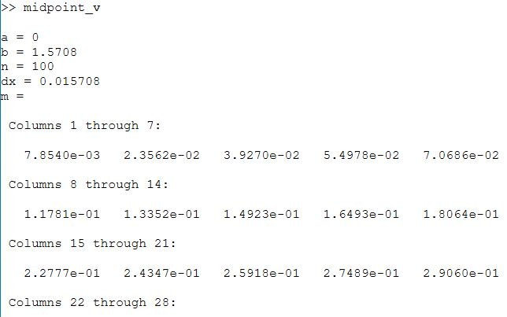
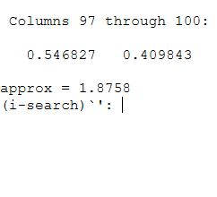

Использую tic и toc, чтобы узнать время выполнения каждого файла и сравниваю результаты

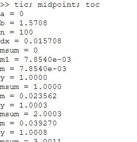
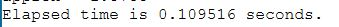

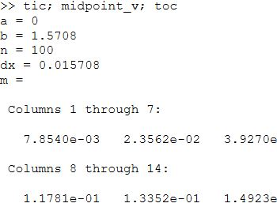
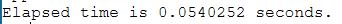

Исходя из результатов мы можем сделать заключение, что второй способ для нахождения аппроксимации является более быстрым.

# Выводы

В процессе выполнения работы, я научилась вычислять пределы, последовательности и ряды в Octave.

