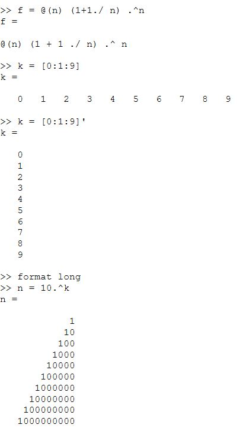
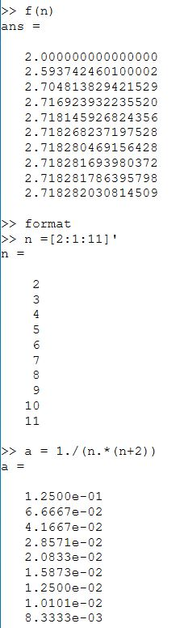
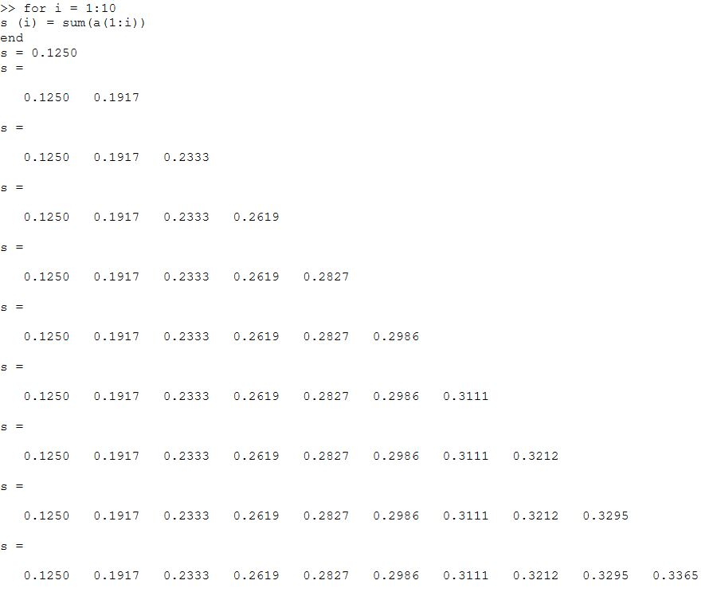
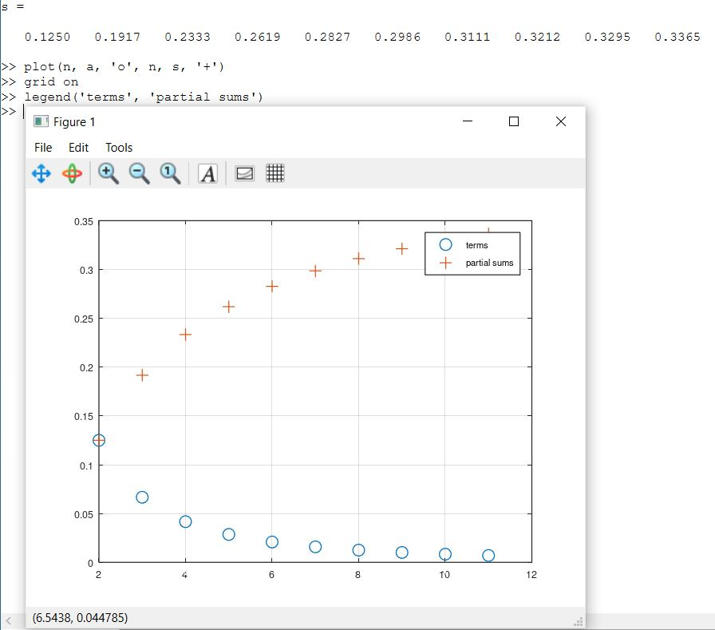

---
## Front matter
title: "Отчёт по лабораторной работе 5"
author: "Супонина Анастасия Павловна"

## Generic otions
lang: ru-RU
toc-title: "Содержание"

## Bibliography
bibliography: bib/cite.bib
csl: pandoc/csl/gost-r-7-0-5-2008-numeric.csl

## Pdf output format
toc: true # Table of contents
toc-depth: 2
lof: true # List of figures
lot: true # List of tables
fontsize: 12pt
linestretch: 1.5
papersize: a4
documentclass: scrreprt
## I18n polyglossia
polyglossia-lang:
  name: russian
  options:
  - spelling=modern
  - babelshorthands=true
polyglossia-otherlangs:
  name: english
## I18n babel
babel-lang: russian
babel-otherlangs: english
## Fonts
mainfont: IBM Plex Serif
romanfont: IBM Plex Serif
sansfont: IBM Plex Sans
monofont: IBM Plex Mono
mathfont: STIX Two Math
mainfontoptions: Ligatures=Common,Ligatures=TeX,Scale=0.94
romanfontoptions: Ligatures=Common,Ligatures=TeX,Scale=0.94
sansfontoptions: Ligatures=Common,Ligatures=TeX,Scale=MatchLowercase,Scale=0.94
monofontoptions: Scale=MatchLowercase,Scale=0.94,FakeStretch=0.9
mathfontoptions:
## Biblatex
biblatex: true
biblio-style: "gost-numeric"
biblatexoptions:
  - parentracker=true
  - backend=biber
  - hyperref=auto
  - language=auto
  - autolang=other*
  - citestyle=gost-numeric
## Pandoc-crossref LaTeX customization
figureTitle: "Рис."
tableTitle: "Таблица"
listingTitle: "Листинг"
lofTitle: "Список иллюстраций"
lotTitle: "Список таблиц"
lolTitle: "Листинги"
## Misc options
indent: true
header-includes:
  - \usepackage{indentfirst}
  - \usepackage{float} # keep figures where there are in the text
  - \floatplacement{figure}{H} # keep figures where there are in the text
---

# Цель работы

Ознакомиться с подгонкой полиномиальной кривой, а также с различными матричными преобразованиями в Octave. Научиться вращать, отражать и дилатировать изображения на графике.

# Теоретическая часть.

## **Подгонка полиномиальной кривой**

Процесс подгонки может быть автоматизирован встроенными функциями Octave. Для этого мы можем использовать встроенную функцию для подгонки полинома polyfit. 

**Синтаксис: polyfit (x, y, order)**,

где order – это степень полинома. Значения полинома P в точках, задаваемых вектором-строкой x можно получить с помощью функции polyval.
**Синтаксис: polyval (P, x).**

## **Матричные преобразования**

Матрицы и матричные преобразования играют ключевую роль в компьютерной графике. Существует несколько способов представления изображения в виде матрицы. Подход, который мы здесь используем, состоит в том, чтобы перечислить ряд вершин, которые соединены последовательно, чтобы получить ребра простого графа. Мы записываем это как матрицу 2 * n , где каждый столбец представляет точку на рисунке. В качестве простого примера, давайте попробуем закодировать граф-домик. Есть много способов закодировать это как матрицу. Эффективный метод состоит в том, чтобы выбрать путь, который проходит по каждому ребру ровно один раз (цикл Эйлера).

**1. Вращение**

Рассмотрим различные способы преобразования изображения. Вращения могут быть получены с использованием умножения на специальную матрицу. Вращение точки (x, y) относительно начала координат определяется как

$$ 
R  \begin{bmatrix} x \\\ y \end{bmatrix}
$$

где,

$$
𝑅 \begin{bmatrix} cos(𝜃) &  − sin(𝜃) \\\ sin(𝜃) & cos(𝜃) \end{bmatrix}
$$

$ \theta $ – угол поворота (измеренный против часовой стрелки).
Теперь, чтобы произвести повороты матрицы данных D, нам нужно вычислить произведение матриц RD.

**2. Отражение**

Если l – прямая, проходящая через начало координат, то отражение точки (x, y) относительно прямой l определяется как

$$ 
R  \begin{bmatrix} x \\\ y \end{bmatrix}
$$

где

$$
𝑅 \begin{bmatrix} cos(2𝜃) &  sin(2𝜃) \\\ sin(2𝜃) & - cos(2𝜃) \end{bmatrix}
$$

$ \theta $ – угол между прямой l и осью абсцисс (измеренный против часовой
стрелки).

**3. Дилатация**

Дилатация (то есть расширение или сжатие) также может быть выполнено путём умножения матриц. Пусть

$$
T \begin{bmatrix} k &  0 \\\ 0 & k \end{bmatrix}
$$

Тогда матричное произведение TD будет преобразованием дилатации
D с коэффициентом k.

# Задание.

1) Выполнить подгонку полиномиальной кривой
2) Провести матричные преобразования
    1. Вращение
    2. Отражение
    3. Дилатация

# Выполнение работы

## Подгонка полиномиальной кривой

Ввожу матрицу и извлекаю из неё значения x и y

При помощи полученных значений строю график 

Строю из матриц уравнение вида $$  𝑦 = 𝑎𝑥^2 + 𝑏𝑥 + c $$.

Записываю исходную матрицу и решаю по методу наименьших квадратов.

Решаю задачу методом Гаусса, используя встроенную функцию rref. В конце выписывая нужные значения в отдельные переменные для отображения на графике

Строю график параболы:

Задаю значения для x

Считаю соответствующие каждому x, значения для y

Рисую график с полученными значениями

Использую встроенную в Octave функцию для нахождения полинома polyfit

Строю график с исходными и подгоночными данными

## Матричные преобразования

Рисую граф в виде дома

### Вращение

Задаю угол вращения и записываю матрицу вращения со значением данного угла. После чего уможаю исходную матрицу для дома на полученную матрицу, для тоже чтобы развернуть исходный граф

Проверяю результат на графике

Повторяю все теже действия, но уже с другим углом

Для наглядности результата, вывожу все три графика на одном

### Отражение

Задаю матрицу R  параметрами для отражения и аналогично предыдущему методу, для получения результата умножаю исходную матрицу на полученную матрицу R. После чего проверяю результат отображаю полученные значения на графике вместе с исходным графиком

### Дилатация

Для дилатации создаю новую матрицу T с ненулевыми и равными значениями на главной диагонали, остальные значения равны нулю и аналогично предыдущим методам умножаю получившуюся матрицу на исходную

Оторбражаю результат на графике, вместе с исходным графов для сравнения

# Выводы

В процессе выполнения работы, я познакомилась с новыми функциями polyfit и polyval, необходимыми для получения полиномиальной кривой, а также научилась без этих функций выполнять подгонку к полиномиальной кривой использую метод наименьшего квадрата и преобразование Гаусса. Изучила матрицы необходимые для матричных преобразований. Научилась изменять графы, а именно отражать, вращать и дилатировать их, используя умножение матрицы исходного графа на специальные матрицы из теоретической части.  

