---
## Front matter
title: "Отчёт по лабораторной работе 7"
author: "Супонина Анастасия Павловна"

## Generic otions
lang: ru-RU
toc-title: "Содержание"

## Bibliography
bibliography: bib/cite.bib
csl: pandoc/csl/gost-r-7-0-5-2008-numeric.csl

## Pdf output format
toc: true # Table of contents
toc-depth: 2
lof: true # List of figures
lot: true # List of tables
fontsize: 12pt
linestretch: 1.5
papersize: a4
documentclass: scrreprt
## I18n polyglossia
polyglossia-lang:
  name: russian
  options:
  - spelling=modern
  - babelshorthands=true
polyglossia-otherlangs:
  name: english
## I18n babel
babel-lang: russian
babel-otherlangs: english
## Fonts
mainfont: IBM Plex Serif
romanfont: IBM Plex Serif
sansfont: IBM Plex Sans
monofont: IBM Plex Mono
mathfont: STIX Two Math
mainfontoptions: Ligatures=Common,Ligatures=TeX,Scale=0.94
romanfontoptions: Ligatures=Common,Ligatures=TeX,Scale=0.94
sansfontoptions: Ligatures=Common,Ligatures=TeX,Scale=MatchLowercase,Scale=0.94
monofontoptions: Scale=MatchLowercase,Scale=0.94,FakeStretch=0.9
mathfontoptions:
## Biblatex
biblatex: true
biblio-style: "gost-numeric"
biblatexoptions:
  - parentracker=true
  - backend=biber
  - hyperref=auto
  - language=auto
  - autolang=other*
  - citestyle=gost-numeric
## Pandoc-crossref LaTeX customization
figureTitle: "Рис."
tableTitle: "Таблица"
listingTitle: "Листинг"
lofTitle: "Список иллюстраций"
lotTitle: "Список таблиц"
lolTitle: "Листинги"
## Misc options
indent: true
header-includes:
  - \usepackage{indentfirst}
  - \usepackage{float} # keep figures where there are in the text
  - \floatplacement{figure}{H} # keep figures where there are in the text
---

# Цель работы

Ознакомиться с параметрическими графиками, полярными координатами, графиками неявных функций, комплексными числами и специальными функциями в Octave. 

# Задание.

Записать и построить графики:
1. Параметрической функции 
2. Полярных координат
3. Неявных функций 
4. Комплексных чисел
5. Специальных функций

# Выполнение работы

## Параметрические функции 

Строю график трех периодов цилкоиды радиуса 2:

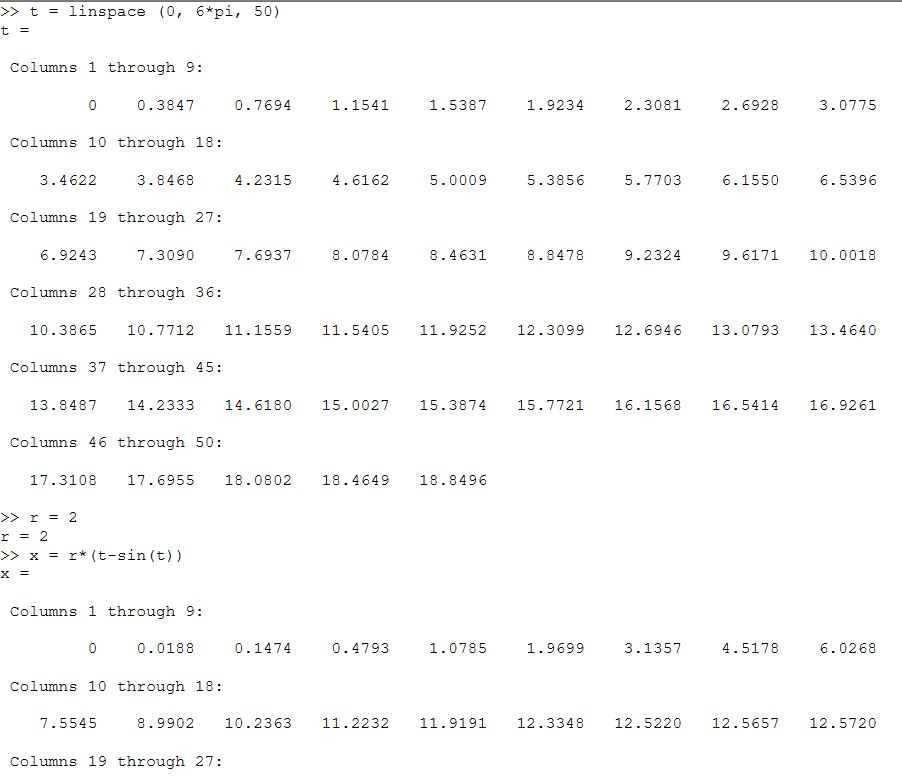
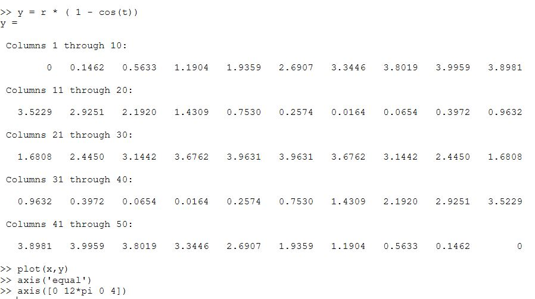
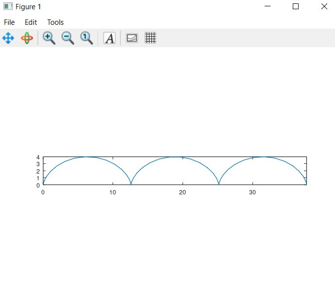

## Полярные координаты

Строю улитку Паскаля

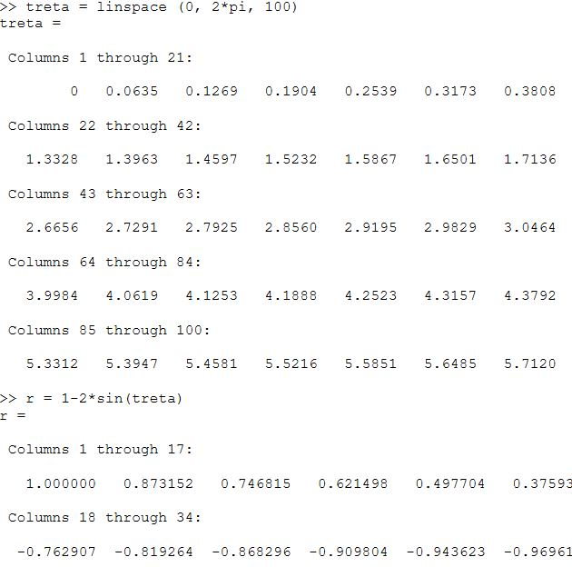
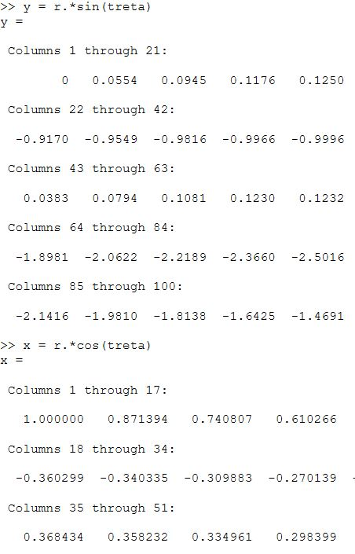
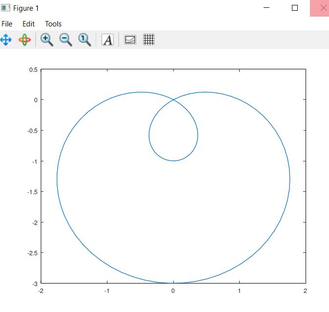

Использую функцию polar, для того, чтобы построить тот же график в полярных координатах.
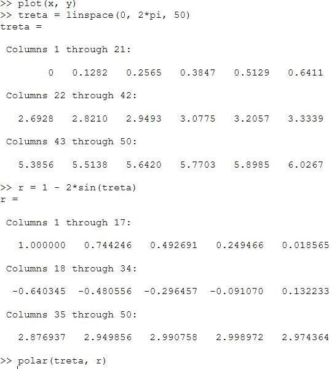
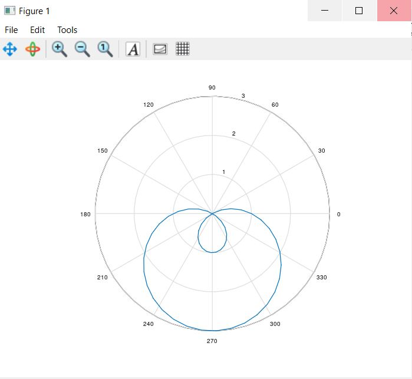

## Неявные функции

Самый простой способ построить неявную функцию в Octave это ezplot.
Строю перфую функцию определяемую уравнением $f = -x^2 - x*y + x + y^2 - y - 1 $

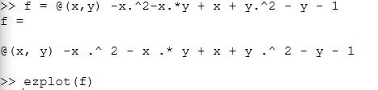
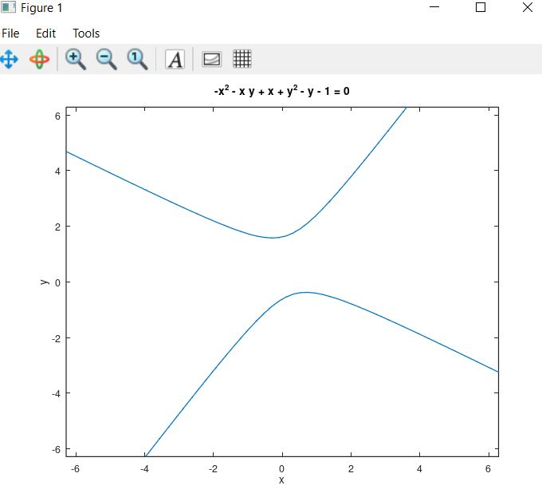

Строю функцию круга и также нахожу касательную к нему, после чего отображаю это на графике

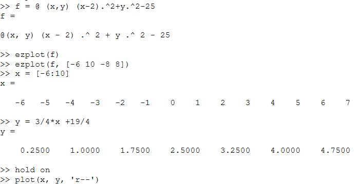
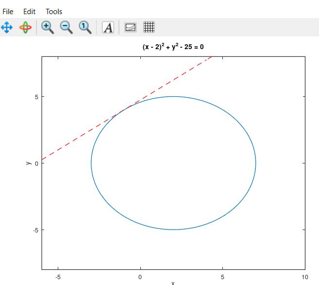

## Комплексные числа

Рассматриваю какие действия можно проводить с комплексными числами и вектрны отображаю их на графике

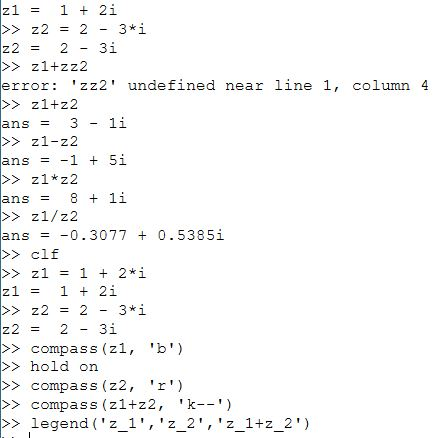
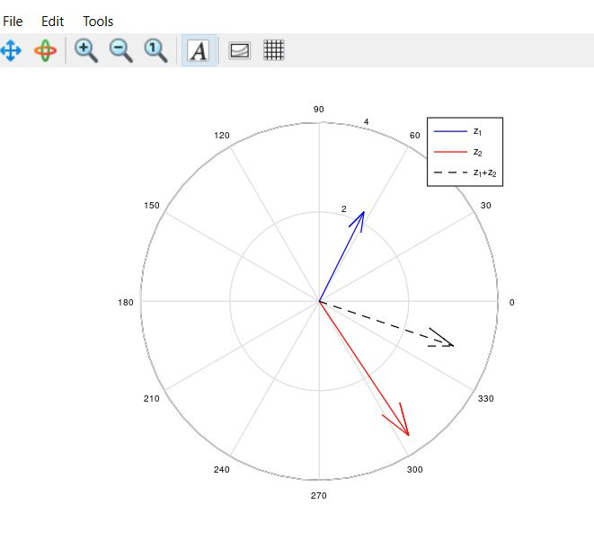

## Специальные функции

Строю на одном графике функции $ Г(x+1) и n! $

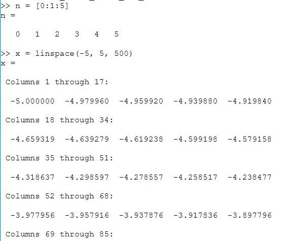
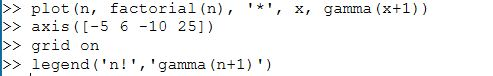
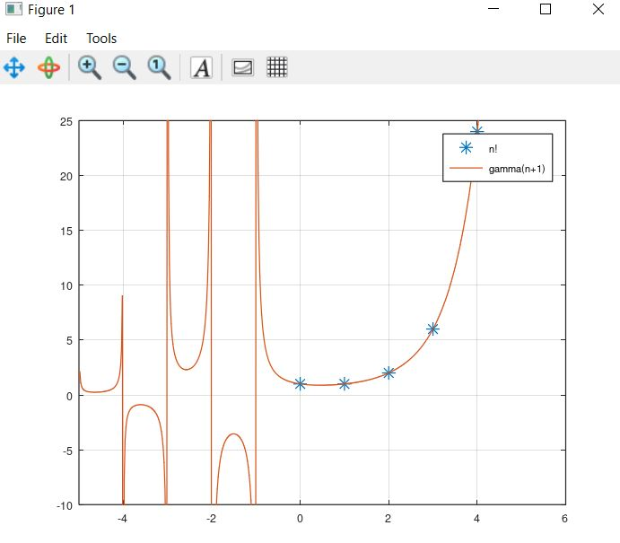

Для того, чтобы избавиться от артефактов вычисления в графике, разбиваю область значения на 5 интервалов и считаю их ещё раз

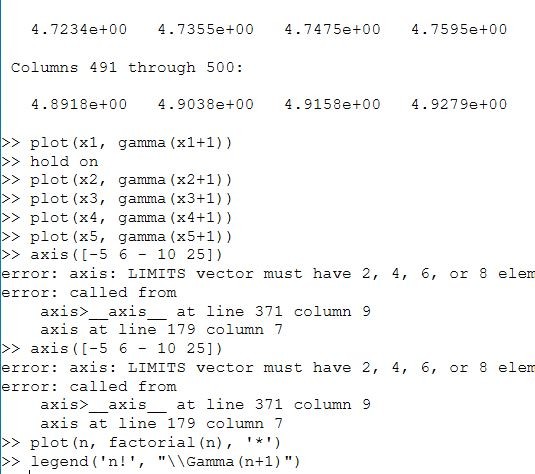
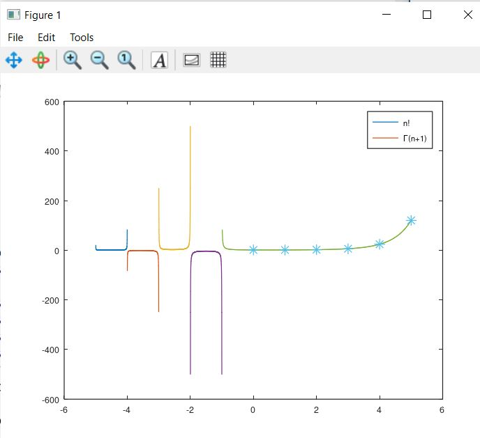

# Выводы

В процессе выполнения работы, я научилась работать с комплексными числами, строить на графиках специальные функции, строить графики в полярных координатах, а также выислять и строить графики параметрических и неявных функций в Octave.

