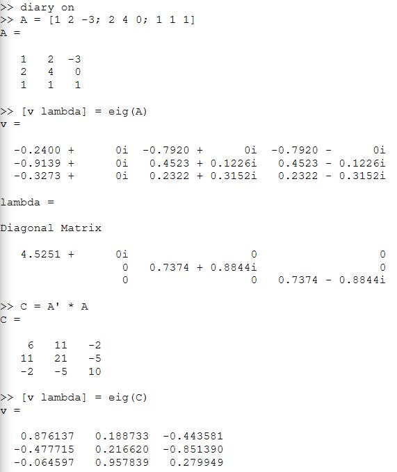
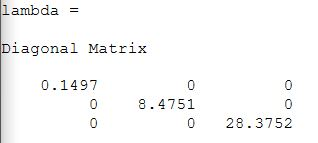
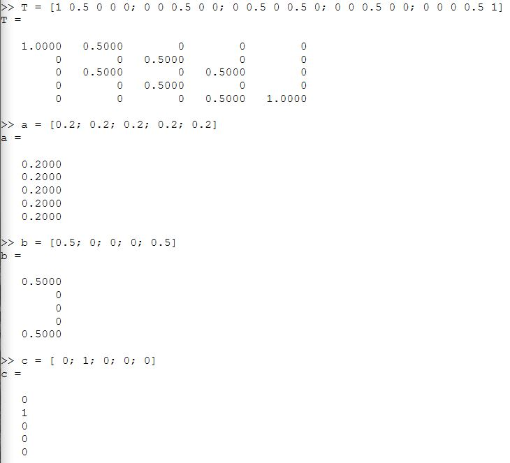
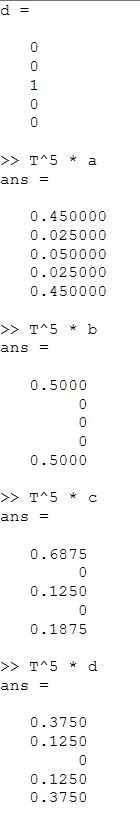
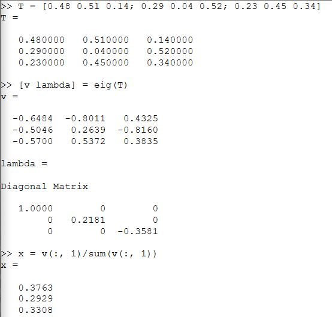
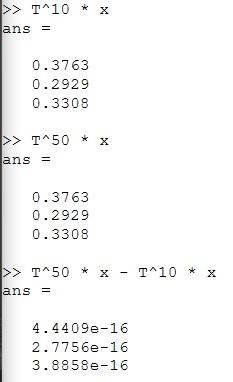

---
## Front matter
title: "Отчёт по лабораторной работе 8"
author: "Супонина Анастасия Павловна"

## Generic otions
lang: ru-RU
toc-title: "Содержание"

## Bibliography
bibliography: bib/cite.bib
csl: pandoc/csl/gost-r-7-0-5-2008-numeric.csl

## Pdf output format
toc: true # Table of contents
toc-depth: 2
lof: true # List of figures
lot: true # List of tables
fontsize: 12pt
linestretch: 1.5
papersize: a4
documentclass: scrreprt
## I18n polyglossia
polyglossia-lang:
  name: russian
  options:
  - spelling=modern
  - babelshorthands=true
polyglossia-otherlangs:
  name: english
## I18n babel
babel-lang: russian
babel-otherlangs: english
## Fonts
mainfont: IBM Plex Serif
romanfont: IBM Plex Serif
sansfont: IBM Plex Sans
monofont: IBM Plex Mono
mathfont: STIX Two Math
mainfontoptions: Ligatures=Common,Ligatures=TeX,Scale=0.94
romanfontoptions: Ligatures=Common,Ligatures=TeX,Scale=0.94
sansfontoptions: Ligatures=Common,Ligatures=TeX,Scale=MatchLowercase,Scale=0.94
monofontoptions: Scale=MatchLowercase,Scale=0.94,FakeStretch=0.9
mathfontoptions:
## Biblatex
biblatex: true
biblio-style: "gost-numeric"
biblatexoptions:
  - parentracker=true
  - backend=biber
  - hyperref=auto
  - language=auto
  - autolang=other*
  - citestyle=gost-numeric
## Pandoc-crossref LaTeX customization
figureTitle: "Рис."
tableTitle: "Таблица"
listingTitle: "Листинг"
lofTitle: "Список иллюстраций"
lotTitle: "Список таблиц"
lolTitle: "Листинги"
## Misc options
indent: true
header-includes:
  - \usepackage{indentfirst}
  - \usepackage{float} # keep figures where there are in the text
  - \floatplacement{figure}{H} # keep figures where there are in the text
---

# Цель работы

Научиться вычислять собственные значения и собственные векторы в Octave. 

# Задание.

Вычислить:
1. Собственные значения и собственные векторы 
2. Случайное блуждание и его равновестное состояние

# Выполнение работы

## Собственные значения и собственные векторы

При помощи функции eig() нахожу собственные значения для заданной матрицы

Также, создаю матрицу С, для того чтобы получить действительные собственные значения, для этого умножаю исходную матрицу на транспонированную и далее вычисляю собственные значения

## Случайное блуждание и его равновестное состояние

Исследую вычисление случайного блуждания в Octave 

Для этого задаю матрицу Т и 5 различных начальных векторов, после чего по формуле $ T^k * a $ вычисляю вероятность будущего состояния

Нахожу равновестное состояние x, которое будет являться равновестным, если $x = Tx$, и проверяю действительно ли оно является равновестным

# Вывод

При выполнении данной лабораторной работы я научилась находить собственные значения и собственные вектора матрицы, а также вычислять случайное блуждание и равновестное состояние в среде программирования Octave.